## Lecture 0
{:.no_toc}

* TOC
{:toc}

## Welcome

* When David was a freshman, he was too intimidated to take any computer science classes. But even if the topic feels out of your comfort zone, know that we'll fill in all the blanks along the way, until we are all on the same page.
* In fact, 68% of CS50 students have never taken a CS course before.
* To support you, there is an amazing staff, sections, and office hours.
* And importantly, too:
  > what ultimately matters in this course is not so much where you end up relative to your classmates but where you end up relative to where you started.

## What is computer science?

* Computer science is fundamentally problem-solving, and programming alone or (more likely) collaboratively is one way to do that.
* Collaboration is an important aspect of problem solving. It can take on many forms, such as communication or consultation. Collaboration helps us see diverse perspectives, which can help us avoid bias in the development of computing innovations.
* We can think of problem-solving as the process of taking some input (details about our problem) and generate some output (the solution to our problem). The "black box" in the middle is what we'll gradually learn more and more about in this course.<br>
  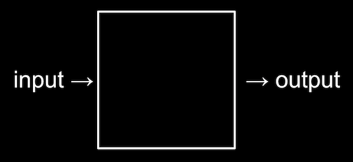
* We need a way to represent inputs in some standard way, and if our problem were to simply count the number of people in the lecture hall, we'd have many options. We could write tally marks on a board, or use our hands. In fact, with just one hand, we can use our fingers creatively: with just our thumb up, we could represent one; with our just index finger up, we could represent two; with both our thumb and index finger up, we could represent three. And by continuing to use a pattern of permutations, we could represent 32 different values with just five fingers!

## Binary

* A computer, at the lowest level, stores data in binary, where there are just two digits, 0 and 1. And that maps to how our computers use electricity, which is easy to turn off or on.
* As humans, we know the following represents one hundred and twenty-three.
  ```
  1 2 3
  ```
  * The `3` is in the ones column, the `2` is in the tens column, and the `1` is in the hundreds column.
  * So `123` is 100×1 + 10×2 + 1×3 = 100 + 20 + 3 = 123.
* In binary, with just two digits, we have powers of two for each place value:
  <pre>
  4 2 1
  <b>0 0 0</b>
  </pre>
  * This would still be equal to 0.
* Now if we change the binary value to, say, `0 1 1`, the decimal value would be 3.
  <pre>
  4 2 1
  <b>0 1 1</b>
  </pre>
* With enough bits, or binary digits, computers can count much higher.
* To represent letters, all we need to do is decide how numbers map to letters. Some humans, many years ago, collectively decided on a standard mapping called [ASCII](https://en.wikipedia.org/wiki/ASCII). The letter "A", for example, is the number 65, and "B" is 66, and so on.
  * A byte is 8 bits, and we use that as a unit to manage bits. The number 72, for example, fits into one byte.
* And computer programs know, based on the context of its code, whether the binary numbers should be interpreted as numbers, or letters, or even other media.

## Representing data

* **Abstraction** is a concept in computer science where some low-level implementation (such as how data is ultimately stored in binary) is simplified or taken for granted, so we can use that implementation at a higher level (such as representing letters, that we can then use in our programs).
* On a standard American keyboard, letters with accent marks, and many other symbols and characters, aren't visible:
  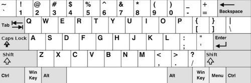
* To solve that problem, computers can represent letters with standards in addition to ASCII.
* It turns out that both letters with accent marks, as well as emoji, can be represented as characters with multiple bytes, with a standard called [Unicode](https://en.wikipedia.org/wiki/Unicode) (one specific version of which is called UTF-8).
  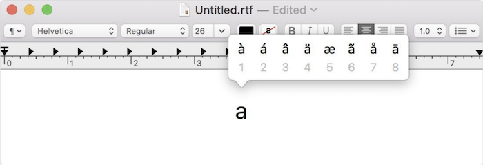
  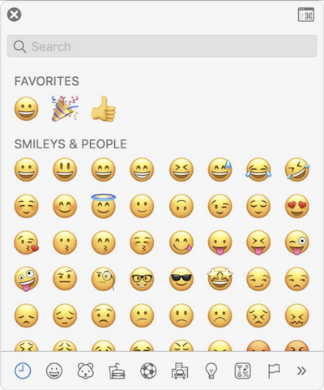
  * When we receive an emoji, our computer is actually just receiving a decimal number like `128514` (`11111011000000010` in binary, if you can read that more easily) that it then maps to the image of the emoji.
* Computers can also use binary to represent images. With three bytes, each representing some amount of red, green, and blue, we can represent millions of colors:<br>
  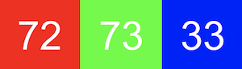
  * The red, green, and blue values are combined to get a light yellow color:<br>
    
* Each image is comprised of thousands or millions of pixels, or squares of colors, that we can see once we zoom in far enough:
  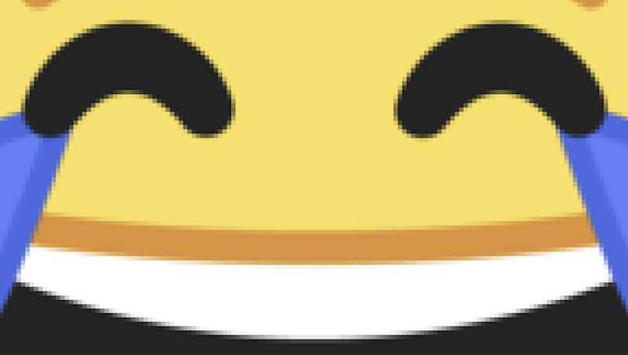
* And videos are just many, many images displayed one after another, at some number of frames per second.
* On newer iPhones, the "Animoji" feature is just lots of images, generated and displayed one after another:
  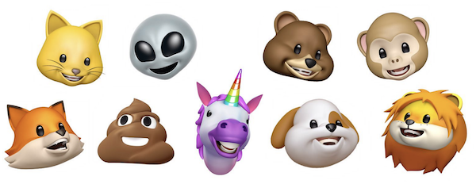
* We can think of videos as abstractions over images, images as abstractions over pixels, and pixels as abstractions over bits.

## Algorithms

* So now we can represent inputs and outputs. Inputs and outputs can come in various forms, such as tactile, audio, visual, or text. The black box earlier will contain *algorithms*, step-by-step instructions for solving a problem:<br>
  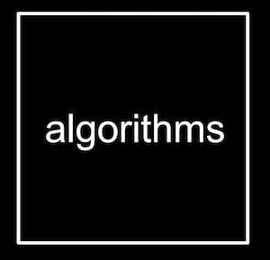
* Let's say we wanted to find a friend, Mike Smith, in a phone book.
  * We could start by flipping through the book, one page at a time, until we find Mike Smith or reach the end of the book.
  * We could also flip two pages at a time, but if we go too far, we'll have to know to go back a page.
  * But the most efficient way would be opening the phone book to the middle, decide whether Mike will be in the left half or right half of the book (because the book is alphabetized), and immediately throw away half of the problem. We can repeat this, dividing the problem in half each time.
*  In fact, we can represent the efficiency of each of those algorithms with a chart:<br>
  
  * Our first solution, one page at a time, is like the red line: our time to solve increases linearly as the size of the problem increases.
  * The second solution, two pages at a time, is like the yellow line: our slope is less steep, but still linear.
  * Our final solution, is like the green line: logarithmic, since our time to solve rises more and more slowly as the size of the problem increases. In other words, if the phone book went from 1000 to 2000 pages, we would need one more step to find Mike. If the size doubled again from 2000 to 4000 pages, we would still only need one more step.
* Instinctively, we knew how to solve this problem since we have encountered it in our day lives, but what if we didn't? We can think about solving a problem or designing a program with different strategies, including but not limited to:
  * brainstorming
  * planning and storyboarding
  * organizing the problem into several components or parts and solving each one modularly
  * creating diagrams or flow charts
  * developing a set of tests check if your program does the desired task
* It is important to investigate multiple solutions based on the constraints of the problem to find the most efficient solution for the desired user. Some methods for investigating are:
  * collecting data via surveys
  * user testing
  * interviewing future users
  * direct observations
* Interviewing future users play a large role in the development process as they can help provide multiple perspectives that the developer may not have thought about.

## Pseudocode

* We can write *pseudocode*, an informal syntax that is just a more specific version of English (or other human language) that represents our algorithm:
  <pre>
   0 pick up phone book
   1 open to middle of phone book
   2 look at names
   3 if Smith is among names
   4     call Mike
   5 else if Smith is earlier in book
   6     open to middle of left half of book
   7     go back to step 2
   8 else if Smith is later in book
   9     open to middle of right half of book
  10     go back to step 2
  11 else
  12     quit
  </pre>
* Some of these lines start with verbs, or actions. We'll start calling these *functions*:
  <pre>
   0 <b>pick up</b> phone book
   1 <b>open to</b> middle of phone book
   2 <b>look at</b> names
   3 if Smith is among names
   4     <b>call</b> Mike
   5 else if Smith is earlier in book
   6     <b>open</b> to middle of left half of book
   7     go back to step 2
   8 else if Smith is later in book
   9     <b>open</b> to middle of right half of book
  10     go back to step 2
  11 else
  12     <b>quit</b>
  </pre>
* We also have questions that lead to different paths, like forks in the road, which we'll call *conditions*:
  <pre>
   0 pick up phone book
   1 open to middle of phone book
   2 look at names
   3 <b>if</b> Smith is among names
   4     call Mike
   5 <b>else if</b> Smith is earlier in book
   6     open to middle of left half of book
   7     go back to step 2
   8 <b>else if</b> Smith is later in book
   9     open to middle of right half of book
  10     go back to step 2
  11 <b>else</b>
  12     quit
  </pre>
* And the answers to questions that decide where we go are called *Boolean expressions*, which eventually result to a value of true or false:
  <pre>
   0 pick up phone book
   1 open to middle of phone book
   2 look at names
   3 if <b>Smith is among names</b>
   4     call Mike
   5 else if <b>Smith is earlier in book</b>
   6     open to middle of left half of book
   7     go back to step 2
   8 else if <b>Smith is later in book</b>
   9     open to middle of right half of book
  10     go back to step 2
  11 else
  12     quit
  </pre>
* Finally, we have words that lead to cycles, where we can repeat parts of our program, called *loops*:
  <pre>
   0 pick up phone book
   1 open to middle of phone book
   2 look at names
   3 if Smith is among names
   4     call Mike
   5 else if Smith is earlier in book
   6     open to middle of left half of book
   7     <b>go back to step 2</b>
   8 else if Smith is later in book
   9     open to middle of right half of book
  10     <b>go back to step 2</b>
  11 else
  12     quit
  </pre>

## Scratch

* We can write programs with the building blocks we just discovered:
  * functions
  * conditions
  * Boolean expressions
  * loops
* We'll use a graphical programming language called [Scratch](https://scratch.mit.edu/), where we'll drag and drop blocks that contain instructions.
* Later in our course, we'll move onto textual programming languages like C, and Python, and JavaScript. All of these languages, including Scratch, has more powerful features like:
  * variables
    * the ability to store values and change them
  * threads
    * the ability for our program to do multiple things at once
  * events
    * the ability to respond to changes in our program or inputs
  * ...
* David's first program in Scratch was [Oscartime](https://scratch.mit.edu/projects/76196420/), which we play with a volunteer. The game involves clicking and dragging trash that falls from the top of the screen:<br>
  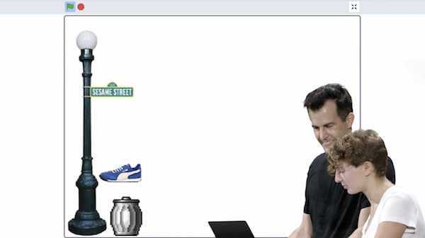
  * We can already start to decompose the program for the game:
    * The animation of the trash can is a sequence of 3 images, displayed one after another.
    * The score was being stored in a variable, and increased with each piece of trash we dragged.
* The programming environment for Scratch looks like this:<br>
  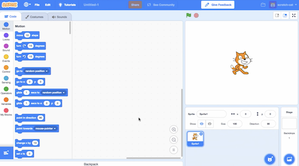
  * On the left, we have puzzle pieces that represent functions or variables, or other concepts, that we can drag and drop into our instruction area in the center.
  * On the right, we have a stage that will be shown by our program to a human, where we can add or change backgrounds, characters (called sprites in Scratch), and more.
* We can drag a few blocks to make Scratch say "hello, world":<br>
  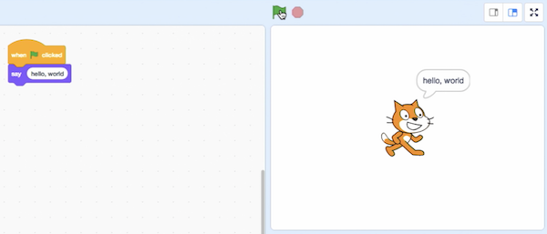
  * The "when green flag clicked" block is the start of our program, and below it we've snapped in a "say" block and typed in "hello, world".
* We can also drag in the "ask and wait" block, with a question like "What's your name?", and combine it with a "say" block for the answer:<br>
  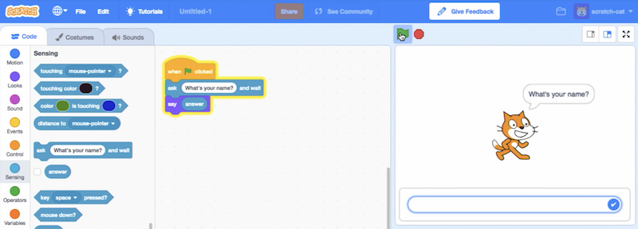
* We can use the "join" block to combine two phrases so Scratch can say "hello, David":<br>
  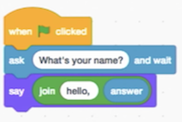
  * Notice that we can nest instructions and variables.
* We can try to make Scratch (the name of the cat) say meow:<br>
  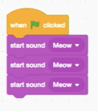
  * But when we click the green flag, we only hear the meow sound once. Our first bug, or mistake! It turns out that computers can do things really quickly, so it went to each block, started playing the sound, and moved on to the next block. So all three "meow"s overlapped and sounded like one.
* We can fix this with "play sound until done", and even "wait" before we say meow again:<br>
  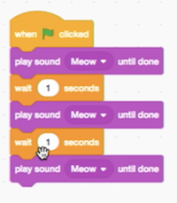
* We can copy and paste these blocks over and over again, but our program can have better design if we use a loop, like the "forever" block:<br>
  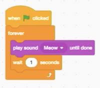
* We have another program, [counting sheep](https://scratch.mit.edu/projects/26329219/):<br>
  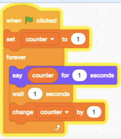
  * Here, "counter" is a variable where we store a value, and increase it every time our sheep says it.
* We can have our sheep double the counter each time, and if we wait a while, eventually the sheep gives up and says "infinity". Since computers has to store values physically, there is only a finite number of bits. The programmer (in this case, the writers of the Scratch language) will have to decide on a limit to how many bits are used for each type of variable, as well as how to handle reaching those limits.
* We can tinker with other blocks, and have Scratch meow when we "pet" him with our mouse pointer:<br>
  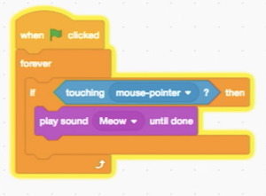
  * We need the "forever" block because, otherwise, our program would check that condition at the very beginning, and then stop.
* We can also use the "if else" block to have different sounds play depending on the condition.
* With a few more blocks, we can make Scratch move on the screen, left and right:<br>
  
* And if we find some images of Scratch with his legs in various positions, we can even simulate walking:<br>
  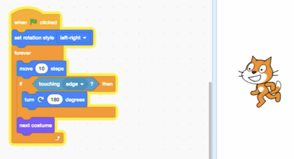
  * In another tab called "Costumes", we can set what Scratch looks like in each frame. And animation is just a more complex version of this.
* By exploring what other blocks we have available, we can have Scratch follow us with blocks like "point toward mouse cursor".
* We can also have multiple scripts, or snippets of code, in the same program:<br>
  
  * With the space bar, we can change the value of the variable called "muted", and the second script will play the sound or not depending on the value of "muted".
* With events, we can have two sprites, each with their own script, interact with each other:<br>
  <br>
  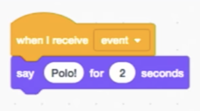
  * We put these sets of blocks on different sprites, and now when we click the green flag, one says "Marco" and the other says "Polo" on its own!
* One sign of a poorly designed program is one where we copy and paste the same code over and over again. The acronym of DRY, or "Don't Repeat Yourself", is a good reminder. For example, instead of duplicating the same blocks, we can use a "repeat" block to do something over and over again.
* The next step is abstracting away some of our code into a function. We can make a block called "cough" and put some blocks inside it:<br>
  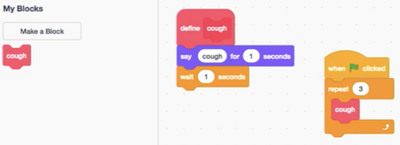
  * Now, all of our sprites can use the same "cough" block, in as many places as we'd like.
* We can even put a number of times into our cough function, so we only need a single block to cough any number of times:<br>
  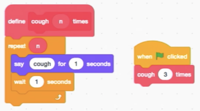
* As we use higher-level programming languages, we'll see more examples of how collections of code written by others, called libraries, will be useful for us to write programs of our own.
* We play more examples of interactive games, written by former students.
* Welcome aboard!
