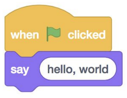
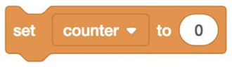
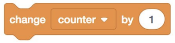
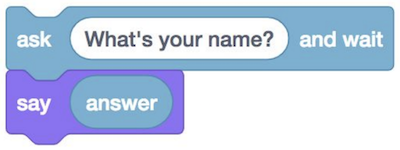
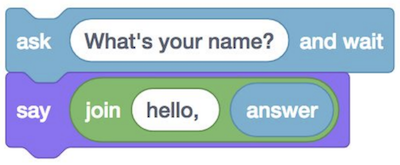
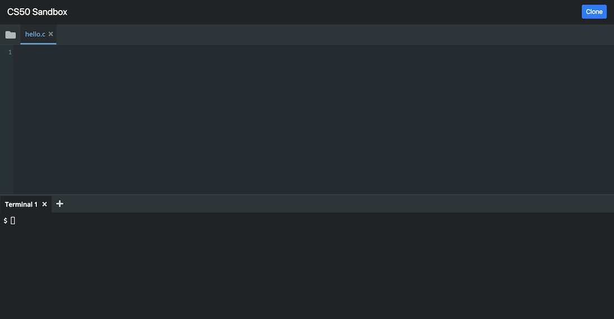
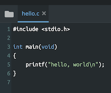

## Lecture 1
{:.no_toc}

* TOC
{:toc}

## Last Time

* We learned that, thanks to many layers of abstraction and those who came before us, we can easily write programs that are ultimately just binary, 0s and 1s.
* Problem solving can be described as taking some inputs (a problem) and using an algorithm to find some outputs (a solution).
* Computers represent inputs and outputs with lots of bits, binary digits, 0s and 1s, that are on or off. And with enough of those bits, we can represent not only larger numbers, but text, images, and video.
* And there can be different algorithms that can solve the same problem, but with different running times.
* We can write down algorithms more precisely with pseudocode, and along the way use concepts like functions, loops, and conditions.
  * With the help of volunteers from the audience, we make peanut butter and jelly sandwiches from ingredients, though each of us interpreted the instructions differently!
* It turns out, we (as humans) naturally make assumptions and abstractions when following instructions or even pseudocode. But as we saw in Scratch, and as we will see in C, we won't be able to do that anymore, and will have to think more carefully about the steps and cases that our programs will need to handle.
  * With Scratch, we were able to leverage the work done by the folks at MIT, who created the blocks, and sprites, to make programs of our own. And we too made custom blocks like the `cough` function, that was a layer of abstraction of our own.

## C

* We'll use a new language, C, that's purely text, which comes with some cryptic keywords and punctuation:
  ```c
  #include <stdio.h>

  int main(void)
  {
      printf("hello, world\n");
  }
  ```
  * This is equivalent to the "when green flag clicked" and "say (hello, world)" block:<br>
    
* We can compare a lot of the constructs in C, to blocks we've already seen and used in Scratch. The syntax is far less important than the principles, which we've already been introduced to.
* The "say (hello, world)" block is a function, and maps to `printf("hello, world\n");`[^1]. In C, the function to print something to the screen is `printf`, where `f` stands for "format", meaning we can format the string in different ways. Then, we use parentheses to pass in what we want to print. We use double quotes to surround our text, or string, and add a `\n` which indicates a new line on the screen. (Then, the next time we call `printf`, our text will be on a new line. Finally, we add a semicolon `;` to end this line of code in C.
* The "set [counter] to (0)" block is creating a variable, and in C we would say `int counter = 0;`, where `int` specifies that the type of our variable is an integer and the equals sign indicates assignment [^2]
:<br>
  
* "change [counter] by (1)" is `counter = counter + 1;` in C. (In C, the `=` isn't like an equation, where we are saying `counter` is the same as `counter + 1`. Instead, `=` means "copy the value on the right, into the value on the left".) We can also say `counter += 1;` or `counter++;` both of which are "syntactic sugar", or shortcuts that have the same effect with fewer characters to type.<br>
  
* A condition[^3] would map to:<br>
  
  ```c
  if (x < y)
  {
      printf("x is less than y\n");
  }
  ```
  * Notice that in C, we use `{` and `}` (as well as indentation) to indicate how lines of code should be nested.
* We can also have if-else conditions:<br>
  
  ```c
  if (x < y)
  {
      printf("x is less than y\n");
  }
  else
  {
      printf("x is not less than y\n");
  }
  ```
  * As another aside, whitespace (the spaces, new lines, and indentation) are generally not syntactically important in C, i.e. they won't change how our program ultimately runs, but following conventions and having good "style" is important for our code to be readable by humans.
* And even `else if`:<br>
  
  ```c
  if (x < y)
  {
      printf("x is less than y\n");
  }
  else if (x > y)
  {
      printf("x is greater than y\n");
  }
  else if (x == y)
  {
      printf("x is equal to y\n");
  }
  ```
  * Notice that, to compare two values in C, we use `==`, two equals signs.
  * And, logically, we don't need the `if (x == y)` in the final condition, since that's the only case remaining, and we can just say `else`.
* Loops can be written like the following:<br>
  
  ```c
  while (true)
  {
      printf("hello, world\n");
  }
  ```
  * The `while` keyword also requires a condition, so we use `true` as the Boolean expression to ensure that our loop will run forever. Our program will check whether the expression evaluates to `true` (which it always will in this case), and then run the lines inside the curly braces. Then it will repeat that until the expression isn't true anymore (which won't change in this case).<br>
  
  ```c
  for (int i = 0; i < 50; i++)
  {
      printf("hello, world\n");
  }
  ```
  * To write a loop that runs a specific number of times, we use the `for` keyword[^4], and first, we create a variable named `i` and set it to 0. `i` is a conventional name for a variable that keeps track of how many iterations of the loop we've already done. Then, we check that `i < 50` every time we reach the top of the loop, before we run any of the code inside. If that expression is true, then we run the code inside. Finally, after we run the code inside, we use `i++` to add one to `i`, and the loop repeats.
* We can also get input from the user:<br>
  
  ```c
  string answer = get_string("What's your name?\n");
  printf("%s\n", answer);
  ```
  * In Scratch, the response will be stored in a variable called "answer", but in C we can specify the name of the variable. We'll choose "answer" too, and the type of this variable is `string`, which is just a sequence of characters.
  * And we'll use `printf` to print the string, but we need to specify how. We first pass in `"%s`, the string we want to print, which happens to be just `%s`. And `%s` is a placeholder, into which `printf` will substitute the value of the string we pass in next, which we specify as `answer`.
  * And we need this structure because now, we can convert this:<br>
    
    ```c
    string answer = get_string("What's your name?\n");
    printf("hello, %s\n", answer);
    ```

## CS50 Sandbox

* The [CS50 Sandbox](https://sandbox.cs50.io/) is a cloud-based, virtual environment where we've installed the right libraries and settings so that we can all start writing and running code the same way. At the top, there is a simple code editor, where we can type text. Below, we have a terminal window, into which we can type commands:<br>
  
* We'll type our code from earlier into the top:<br>
  
  * Notice that our code is colorized, so that certain things are more visible.
  * And we write our code and save it into a file, to something like `hello.c` to indicate that it is written in C.
* Once we save the code that we wrote, which is called *source code*, we need to convert it to *machine code*, binary instructions that the computer understands more directly.
  * We use a program called a *compiler* to compile our source code into machine code.
* To do this, we use the Terminal panel. The `$` at the left is a prompt, into which we can type commands.
* We type `clang hello.c` (where `clang` stands for "C languages") and ... nothing happens. We see another `$`, waiting for another command. We can click the folder icon on the top left of CS50 Sandbox, and see that we have another file now, called `a.out`. Now, we can type `./a.out` in the terminal prompt, and see `hello, world`. We just wrote, compiled, and ran our first program!
* We can change the name of our program from `a.out` to something else. We can pass *command-line arguments* to programs in the terminal, if they accept them. For example, we can type `clang -o hello hello.c`, and `-o hello` is telling the program `clang` to save the compiled output as just `hello`. Then, we can just run `./hello`. (The `.` means the current folder.)
* We can even abstract this away and just type `make hello`. We see that, by default (in the CS50 Sandbox), `make` uses `clang` to compile our code from `hello.c` into `hello`, with other special features.
* Now, let's try to get input from the user.
  ```c
  #include <stdio.h>

  int main(void)
  {
      string name = get_string("What is your name?\n");
      printf("hello, name\n");
  }
  ```
  * If we run `make hello`, we get lots and lots of errors now. But, in cases like this, we should scroll up to the top, and see what that error is, since the first one might have led to all the others.
  * We see that the first error is `hello.c:5:5: error: use of undeclared identifier 'string' ...`. This tells us that, on line 5, character 5, of the file `hello.c`, the compiler encountered something called `string` that it didn't recognize. In fact, the language C doesn't have a type called `string`.
* To simplify things (at least for the beginning), we'll include a library, or set of code, from CS50. The library provides us with the `string` variable type, the  `get_string` function, and more. We just have to write a line at the top to `include` the file `cs50.h`:
  ```c
  #include <cs50.h>
  #include <stdio.h>

  int main(void)
  {
      string name = get_string("What is your name?\n");
      printf("hello, name\n");
  }
  ```
  * And `stdio.h` is a library that comes with C, that stands for "standard input/output", which includes the `printf` function that prints to the screen,
* Now, if we try to compile that code, our first error is `hello.c:6:12: error: unused variable 'name' ...`. It turns out, we didn't do anything with the `name` variable after we created it. To do that, we need to change the next line:
  ```c
  #include <cs50.h>
  #include <stdio.h>

  int main(void)
  {
      string name = get_string("What is your name?\n");
      printf("hello, %s\n", name);
  }
  ```
  * We're passing in two arguments, or parameters, to `printf`. The first is the string we want to print, with our `%s` placeholder, and the second is the variable `name` that we want to substitute in.
* If we change our code, we need to save our file and run `make hello` again. And, if we wanted to stop our program before it finishes, we just need to press control-C.
* Functions, like `get_string` or `printf`, can take arguments. They can also have return values, and `get_string` returns something of the type `string`.
* You can find the full documentation for the CS50 Sandbox at [cs50.readthedocs.io](cs50.readthedocs.io/sandbox)

## More examples

* The CS50 library has other functions, getting input of various types:
  * `get_char`
  * `get_double`
  * `get_float`
  * `get_int`
  * `get_long`
  * `get_string`
  * ...
* And there are corresponding types in C and ways to print them with `printf`:
  * `bool`
  * `char`, `%c`
  * `double`
  * `float`, `%f`
  * `int`, `%i`
  * `long`, `%li`
  * `string`, `%s`
* The CS50 Sandbox has various languages we can choose from, as well as a file name we can get started with.
* In fact, for each of these examples, you can click on the sandbox links on the [curriculum](https://cs50.harvard.edu/2018/fall/weeks/1/) to run and edit your own copies of them.
* In `int.c`, we get and print an integer:
  ```c
  #include <cs50.h>
  #include <stdio.h>

  int main(void)
  {
      int i = get_int("Integer: ");
      printf("hello, %i\n", i);
  }
  ```
  * Notice that we use `%i` to print an integer.
  * `int main(void)` is the equivalent of "when green flag clicked", and we'll learn more about that in the coming weeks.
  * We can now run `make int` and run our program with `./int`.
* In `float.c`, we can get decimal numbers (called floating-point values in computers, because the decimal point can "float" between the digits, depending on the number):
  ```c
  #include <cs50.h>
  #include <stdio.h>

  int main(void)
  {
      float f = get_float("Float: ");
      printf("hello, %f\n", f);
  }
  ```
  * Now, if we compile and run our program, we see something like `hello, 42.000000`, even if we just typed in `42` at the prompt.
* With `ints.c`, we can do some math[^5]:
  ```c
  #include <cs50.h>
  #include <stdio.h>

  int main(void)
  {
      // Prompt user for x
      int x = get_int("x: ");

      // Prompt user for y
      int y = get_int("y: ");

      // Perform arithmetic
      printf("x + y = %i\n", x + y);
      printf("x - y = %i\n", x - y);
      printf("x * y = %i\n", x * y);
      printf("x / y = %i\n", x / y);
      printf("x mod y = %i\n", x % y);
  }
  ```
  * First, we get two integers, `x` and `y`. Then, we print out what we want to do, like `x + y = %i\n`, and pass in the value we want, `x + y`. `*` is used for multiplication, and `/` for division. `%` on its own, between two variables, is the [modulo operator](https://en.wikipedia.org/wiki/Modulo_operation). [^6]
  * Interestingly, when we pass in `2` for `x` and `10` for `y`, we got ... `x - y = 0`. It turns out, since the two variables are integers, the result is an integer, and since 2 divided by 10 is less than 1, all we have left is the 0.
* With `floats.c`, we can see what happens when we use floats:
  ```c
  #include <cs50.h>
  #include <stdio.h>

  int main(void)
  {
      // Prompt user for x
      float x = get_float("x: ");

      // Prompt user for y
      float y = get_float("y: ");

      // Perform division
      printf("x / y = %.50f\n", x / y);
  }
  ```
  * With `%50f`, we can specify the number of decimal places displayed.
  * Hmm, now we get ...
  ```
  x: 2
  y: 10
  x / y = 0.20000000298023223876953125000000000000000000000000
  ```
* Our computer has memory, in hardware chips called RAM, random-access memory. Our programs use that RAM to store data as they run, but that memory is finite. So with a finite number of bits, we can't represent all possible numbers (of which there are an infinite number of). So our computer has a certain number of bits for each float, and has to round to the nearest decimal value at a certain point.
* And these imprecisions can be problematic in finance, rockets, or scientific applications. But we can get around this problem, by specifying the number of decimal places we will be precise to, and allocate the right number of bits to represent that many decimal places.
* A float in C, on most computers, uses 4 bytes, or 32 bits. Another type, called a double, uses twice as many bits, or 8 bytes.
* If we run `doubles.c`, which is `floats.c` but with the `double` type for variables, we see that we have many more decimal digits of precision. And the tradeoff for the additional precision is that we now have to use more memory space.
* Let's look at `parity.c`:
  ```c
  #include <cs50.h>
  #include <stdio.h>

  int main(void)
  {
      // Prompt user for integer
      int n = get_int("n: ");

      // Check parity of integer
      if (n % 2 == 0)
      {
          printf("even\n");
      }
      else
      {
          printf("odd\n");
      }
  }
  ```
  * By taking the remainder after we divide `n` by 2, we can tell whether `n` is even or odd.
* In `conditions.c`, we turn the snippet from before into a program:
  ```c
  #include <cs50.h>
  #include <stdio.h>

  int main(void)
  {
      // Prompt user for x
      int x = get_int("x: ");

      // Prompt user for y
      int y = get_int("y: ");

      // Compare x and y
      if (x < y)
      {
          printf("x is less than y\n");
      }
      else if (x > y)
      {
          printf("x is greater than y\n");
      }
      else
      {
          printf("x is equal to y\n");
      }
  }
  ```
* In `answer.c`, we get text from the user:
  ```c
  #include <cs50.h>
  #include <stdio.h>

  int main(void)
  {
      // Prompt user for answer
      char c = get_char("Answer: ");

      // Check answer
      if (c == 'Y' || c == 'y')
      {
          printf("yes\n");
      }
      else if (c == 'N' || c == 'n')
      {
          printf("no\n");
      }
  }
  ```
  * Here, we use `get_char` and the `char` data type to get a single character from the user.
* The algorithms we use here can be helpful for building more complex algorithms. We could imagine that we could use the sum algorithm as a start to build a program that takes the average of multiple numbers. Similarly we can think about the programs we write for physical objects like robots. The algorithms to move a robot forwards, backwards, left, and right is likely something someone has already implemented, but we could build something more complex based off of that like determining the robot's path through a maze.
  #### Logical Operators
  * The logical operators we have access to are "and", "or", and "not"[^7].
  * | C syntax | Operator | Example (suppose `x = 5` and `y = 4`) |
|:----------:|:------:|-------------------------------|
| `&&` | AND | `x < 10 && y > 3` --> `true` |
| `||` | OR | `x < 2 || y > 3` --> `true` |
| `!` | NOT | `!(x==y)` --> `true` |
  * Notice that we use a `||` to indicate an "or" in our Boolean expression. (A logical "and" would be `&&`.)
* In Scratch, we were able to create our own block, that we called "cough". We can do the same in C, by creating our own function.
* If we wanted to print "cough" 3 times, we could use a `for` loop:
  ```c
  #include <stdio.h>

  int main(void)
  {
      for (int i = 0; i < 3; i++)
      {
          printf("cough\n");
      }
  }
  ```
* We can move the `printf` line to its own function:
  ```c
  #include <stdio.h>

  void cough(void);

  int main(void)
  {
      for (int i = 0; i < 3; i++)
      {
          cough();
      }
  }

  // Cough once
  void cough(void)
  {
      printf("cough\n");
  }
  ```
  * Notice that we need to declare that the `cough` function exists, so we need the prototype, `void cough(void);`, before our `main` function calls it. The C compiler reads our code from top to bottom, so we need to tell it that the `cough` function exists, before we use it. And we want to keep our `main` function close to the top, so the actual implementation of `cough` will still be below it.
  * In fact, `cs50.h` and `stdio.h` are both header files, containing prototypes for functions like `get_string` and `printf` that we can then use. The actual implementation of those files are in `cs50.c` and `stdio.c` as source code, and compiled to files elsewhere on the system.
  * And our `cough` function doesn't take any inputs, so we have `cough(void)`, and the function also doesn't return anything, so we have `void` in front of `cough` as well. (Our `main` function is supposed to return an `int`, and by default it will return `0` if nothing goes wrong.)
* We can abstract `cough` further:
  ```c
  #include <stdio.h>

  void cough(int n);

  int main(void)
  {
      cough(3);
  }

  // Cough some number of times
  void cough(int n)
  {
      for (int i = 0; i < n; i++)
      {
          printf("cough\n");
      }
  }
  ```
  * Now, when we want to print "cough" some number of times, we can just call that same function. Notice that, with `cough(int n)`, we indicate that the `cough` function takes as input an `int`, which we refer to as `n`. And inside `cough`, we use `n` in our `for` loop to print "cough" the right number of times.
* Let's look at `positive.c`:
  ```c
  #include <cs50.h>
  #include <stdio.h>

  int get_positive_int(string prompt);

  int main(void)
  {
      int i = get_positive_int("Positive integer: ");
      printf("%i\n", i);
  }

  // Prompt user for positive integer
  int get_positive_int(string prompt)
  {
      int n;
      do
      {
          n = get_int("%s", prompt);
      }
      while (n < 1);
      return n;
  }
  ```
  * The CS50 library doesn't had a `get_positive_int` function, but we can write one ourselves. In our function, we initialize a variable, `int n`, but not assign a value to it yet. Then, we have a new construct, `do ... while`, which does something _first_, then checks a condition, and repeats until the condition is no longer true.
  * Then, once we have an `n` that is not `< 1`, we can return it with the `return` keyword. And back in our `main` function, we can set `int i` to that value.
  * In C, variables also have *scope*, which generally means that they only exist within the curly braces that they were declared. For example, if we had `int n = get_int(...)` within the do-while loop, we wouldn't be able to `return` it, since that line would be outside of the scope of `n`. (Similarly, our `main` function can't directly see any variables inside `get_positive_int`, since each function has its own set of curly braces and thus different scopes for variables declared inside them.)
* In Scratch, you might have noticed that you could make a variable available to one sprite, or all sprites. And in C, we have both *local* and *global* variables. All variables we've seen thus far are local, though eventually we'll see global variables, which we'll be able to use anywhere in our program.

## More problems

* We've already seen an example of floating-point imprecision, but we can also have problems with integers.
* If, for example, we had a number like 129, to which we added a 1, we wouldn't have 1210, where the last digit went from 9 to 10. Instead, we carry the 1, such that the number we have is 130. And if we had a number like 999, we would carry the 1 a few times, until we got the number 1000.
* But if we only had space to write down 3 digits, we would end up with 000. And this problem is called overflow, where the number we are trying to store is too big for the amount of space we have allocated.
* In binary, if we had the number `111`, and added 1, we would carry that 1 until we got `1000`. And similarly, if we only had 3 bits, we would have `000`.
* In the Lego Star Wars game, there is a set maximum of 4 billion coins that the player can collect, since presumably there are only 32 bits used to store that count (and 2 to the power of 32 is slightly over 4 billion).
* We can see this in `overflow.c`:
  ```c
  #include <stdio.h>
  #include <unistd.h>

  int main(void)
  {
      // Iteratively double i
      for (int i = 1; ; i *= 2)
      {
          printf("%i\n", i);
          sleep(1);
      }
  }
  ```
  * Notice that here, we have a line that starts with `//`, which indicates a comment. A comment is a note to ourselves or future readers, that the compiler will ignore. Not all environments will support textual comments in the same way, so it is important to think about other ways to document your code.
  * In our `for` loop, we set `i` to `1`, and double it with `*= 2`. (And we'll keep doing this forever, so there's no condition we check.)
  * We also use the `sleep` function from `unistd.h` to let our program pause each time.
  * Now, when we run this program, we see the number getting bigger and bigger, until:
    ```
    1073741824
    overflow.c:9:31: runtime error: signed integer overflow: 1073741824 * 2 cannot be represented in type 'int'
    -2147483648
    0
    0
    ...
    ```
  * It turns out, our program recognized that a signed integer (an integer with a positive or negative sign) couldn't store that next value, and printed an error. Then, since it tried to double it anyways, `i` became a negative number, and then 0.
* The Y2K problem arose because many programs stored the calendar year with just two digits, like 98 for 1998, and 99 for 1999. But when the year 2000 approached, the programs would have stored 00, leading to confusion between the years 1900 and 2000.
* A Boeing 787 airplane also had a bug where a counter in the generator overflows after a certain number of days of continuous operation, since the number of seconds it has been running could no longer be stored in that counter.
* In an older version of Civilization, integer underflow leads to one of the characters, Gandhi, becoming much more aggressive since his "aggression" value, already low,  becomes large when too much is subtracted from it. For example, if we had `00000001` stored, and subtract 1 from it, we would have `00000000`. But if we were to subtract 2, we actually roll backwards to `11111111`, which is the largest positive value!
* So, we've seen a few problems that can happen, but hopefully now too understand why and how to prevent them.
* With this week's problem set, we'll use the CS50 Lab, built on top of the CS50 Sandbox, to write some programs with walkthroughs to guide us.

---

[^1]:In the exam reference sheet for the AP CSP exam, `DISPLAY(expression)` displays or "prints" the value of an expression followed by a space.

[^2]:In the exam reference sheet for the AP CSP exam, "←" is used to indicate assignment instead of "=".

[^3]: In the exam reference sheet for the AP CSP exam, `=`, `≠`, `>`, `<`, `≥`, and `≤` are relational operators that are evaluated as a Boolean value. For example `a = b` would return `true` if `a` and `b` are equal. The syntax for an `if` block in the AP CSP exam reference sheet is:
    ```
    IF(condition)
    {
    <block of statements>
    }
    ```
    and the syntax for an `if-else` block is
    ```
    IF(condition)
    {
     <first block of statements>
    }
    ELSE
    {
     <second block of statements>
    }
    ```

[^4]: The syntax for a `for` loop in the AP CSP Exam reference sheet is:
    ```
    REPEAT n TIMES
    {
     <block of statements>
    }
    ```
    The syntax for a `while` loop in the AP CSP Exam reference sheet is:
    ```
    REPEAT UNTIL(condition)
    {
     <block of statements>
    }
    ```
    The syntax for iterating over a list in the AP CSP Exam reference sheet is:
    ```
    FOR EACH item IN aList
    {
     <block of statements>
    }
    ```

[^5]: In the exam reference sheet for the AP CSP exam:
    * `a + b` indicates addition
    * `a - b` indicates subtraction
    * `a * b` indicates multiplication
    * `a / b` indicates division
    * `a MOD b` indicates modulo

[^6]: In terms of order of operations, modulo operators have the same precedence as multiplication and division.

[^7]: In the exam reference sheet for the AP CSP exam, `AND`, `OR`, `NOT` are the syntactical equivalents of `&&`, `||`, and `!`.
