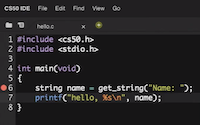
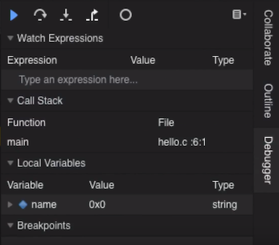
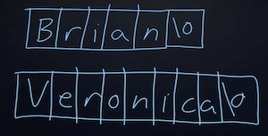
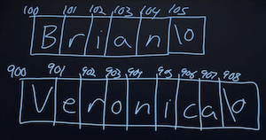
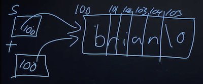
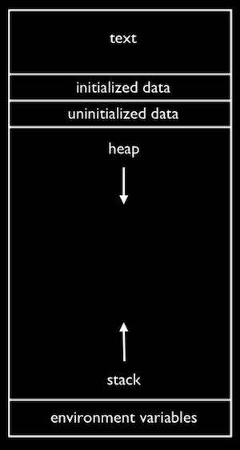
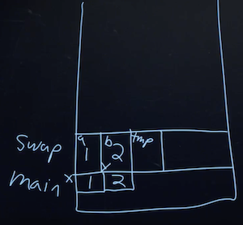
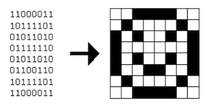

## Lecture 3
{:.no_toc}

* TOC
{:toc}

## Enhance

* We watch a clip, [CSI Zoom Enhance](https://www.youtube.com/watch?v=i3gv2zOmJiA), where the main characters zoom in further and further into an image, revealing more and more details. Today, we'll see how that works (or doesn't) in reality.

## Last time

* We talked about the details of compiling, which is actually made of four steps:
  * First, our source code is *preprocessed*, so any header files like `stdio.h` that we include, are actually included.
  * Then, our code is *compiled* into assembly code, instructions that our CPU can understand.
  * Then, that assembly code is further *assembled* into the binary that match those assembly instructions.
  * Finally, the compiled library files that we wanted to include, such as `cs50.c` or `printf.c`, are *linked*, or merged with our program.
* We discovered some helpful tools:
  * `help50`, which might help us understand error messages
  * `printf`, which can help us understand our program as it runs
  * `style50`, which checks the style of our code so it's more readable and consistent

## CS50 IDE

* CS50 IDE is like the CS50 Sandbox, but with more features. It is an online development environment, with a code editor and a terminal window, but also tools for debugging and collaborating:<br>
  
* Once we log in, we'll see a workspace that looks similar to that of CS50 Sandbox, but now our workspace will be saved to our account.
* We can create a new file with File > New File (or the green plus sign), and use File > Save to save it as `hello.c` in the folder `~/workspace/`. Now we'll write our simple program:
  ```c
  #include <stdio.h>

  int main(void)
  {
      printf("hello, world\n");
  }
  ```
  * And we'll need to manually save, with File > Save or the keyboard shortcut.
* Now, in the terminal window below, we can type `make hello` and `./hello` to see our program run.
* The folder icon at the top left will show us all our files in a directory (folder) called `~/workspace/`, and we can create folders and files inside. The `~` symbol refers to our home directory in this environment, which is just the set of all the files related to our account, and `workspace` is a folder inside `~` that we can use. (The `~` directory also has other configuration files for our account, but we won't need to worry about them.)
* In the terminal, we see `~/workspace/ $ `. The `$ ` part of the prompt is the same as before, after which we can type a command, but the first part of the prompt tells us the directory our terminal is in. For example, we can type `ls`, and we'll see a textual version of the `workspace` directory. And `./hello` refers to a file called `hello` in `.`, which is the current folder.
* We can change our directory with `cd`, and if we type something like `cd src3` (assuming we have a folder already named `src3`), we'll see our prompt change to `~/workspace/src3/ $ `.
* We can delete files and folders with the graphical file tree, right-clicking them as we might be familiar with already. But we can do the same in the command line, with `rm hello`, which will remove files. The command will ask us for a confirmation, and we can type `yes` or `y` (or `n`, if we've changed our minds).
* We can create directories with `mkdir test`, and `rmdir` to remove them.

## Tools

* In the CS50 IDE, we've also added another tool, `check50`. Like `style50`, we wrote this tool to automatically check the correctness of your programs, by passing in inputs and looking at their outputs.
* After we write a program from a problem set, and have tested it ourselves with a few inputs, we can type `check50 cs50/problems/2019/ap/hello`. The `cs50/problems/2019/ap/hello` is an indicator for the program specification that `check50` should check, and once we run that command, we'll see `check50` uploading our code and checking it.
* We can also now use a tool called a *debugger*, built into the CS50 IDE.
* After we compile our code, we can run `debug50 ./hello`, which will tell us to set a breakpoint first. A *breakpoint* indicates a line of code where the debugger should pause our program, until we choose to continue it. For example, we can click to the left of a line of our code, and a red circle will appear:<br>
  
* Now, if we run `debug50 ./hello` again, we'll see the debugger panel open on the right:<br>
  
* We see that the variable we made, `name`, is under the `Local Variables` section, and see that there's a value of `0x0` (which is `null`), and a type of `string`, as we expected.
* Our breakpoint has paused our program _before_ line 6, so to continue, we have a few controls in the debugger panel. The blue triangle will continue our program until we reach another breakpoint. The curved arrow to its right will "step over" the line, running it and pausing our program again immediately after. The arrow pointing downward will "step into" the line, if there is a function being called. And the arrow pointing up and to the right will "step out" of a function, if we are in one.
* So, we'll use the curved arrow to run the next line, and see what changes after. After we type in our name, we'll see that the `name` variable is also updated in the debugger.
* We can save lots of time in the future by investing a little bit now to learn how the debugger works!

## Strings

* We've been using helpful functions from the CS50 Library, like `get_int` or `get_string`, to get input of a specific type from the user. These functions are generally tricky to write, because we want to prompt the user over and over again, if the input they give us isn't actually valid.
* Today, we'll look into the `string` type. As we learned last time, a string is just an array of characters, stored back-to-back. But let's investigate what a `string` variable actually is.
* Let's open `compare0.c`:
  ```c
  #include <cs50.h>
  #include <stdio.h>

  int main(void)
  {
      // Get two integers
      int i = get_int("i: ");
      int j = get_int("j: ");

      // Compare integers
      if (i == j)
      {
          printf("same\n");
      }
      else
      {
          printf("different\n");
      }
  }
  ```
  * As expected, if we provide the same values for `i` and `j`, we see that they're the same.
* In `compare1.c`, we'll try to do the same with strings:
  ```c
  #include <cs50.h>
  #include <stdio.h>

  int main(void)
  {
      // Get two strings
      string s = get_string("s: ");
      string t = get_string("t: ");

      if (s == t)
      {
          printf("same\n");
      }
      else
      {
          printf("different\n");
      }
  }
  ```
  * Hmm, no matter what we type in for our strings, our program thinks they are different.
* It turns out, `string` is not actually a data type in C. The word "string" is common in computer science, but there is no way to store strings in C. Instead, we defined that type in the CS50 Library.
* Recall that strings are just arrays of characters, so when we ran our `compare1` program, we got two strings as input from the user, and those might be stored in memory as the following:<br>
  
  * Each character is in one byte, and somewhere we have bytes in memory containing the values for each of string.
* It turns out, each byte in memory has a numeric location, or *address*. For example, the character `B` might have the address 100, and `V` might have ended up in `900` (depending on what parts of memory were available, or free):<br>
  
  * Notice that, since each string is an array of characters, each character within the array has consecutive addresses, since they are stored next to each other in memory. But the strings themselves might have very different addresses.
* So, `get_string` actually returns just the address of the first character of the string. (We can tell where it ends by looking for the `null` character, `\0`.) Now, we can infer that comparing two "strings" actually just compares two addresses (which will always be different, since `get_string` stores the input in a new place each time), even if the characters stored at those addresses are the same.
* Other data types in C, such as `int`s or `float`s, are generally passed and stored as their values, since they are always a fixed number of bytes. Strings, on the other hand, are passed as their addresses, since they could be really long.
* If we do want to compare two strings, it seems like what we need to do is compare each character one at a time:
  ```c
  #include <cs50.h>
  #include <stdio.h>
  #include <string.h>

  bool compare_strings(string a, string b);

  int main(void)
  {
      // Get two strings
      string s = get_string("s: ");
      string t = get_string("t: ");

      // Compare strings for equality
      if (compare_strings(s, t))
      {
          printf("same\n");
      }
      else
      {
          printf("different\n");
      }
  }

  bool compare_strings(string a, string b)
  {
      // Compare strings' lengths
      if (strlen(a) != strlen(b))
      {
          return false;
      }

      // Compare strings character by character
      for (int i = 0, n = strlen(a); i < n; i++)
      {
          // Different
          if (a[i] != b[i])
          {
              return false;
          }
      }

      // Same
      return true;
  }
  ```
  * We write a function[^1] called `compare_strings`, which takes in two strings as arguments, and return a `bool`, or Boolean expression.
  * First, we compare the strings' lengths, and `return false` if they are not the same. Then, we can check each character, and `return false` if we get to any that are different.
  * We also need to remember to add the prototype, `bool compare_strings(string a, string b);` to the top.
* A `string` is actually a synonym for a `char *`. The `*` in C (which also means multiplication, depending on the context), means that the data type is an address. So a `char *` is an address to a `char`. And such a variable type is called, more formally, a *pointer*.
* Now, we can replace `char *` where we've been using string:
  ```c
  #include <cs50.h>
  #include <stdio.h>
  #include <string.h>

  bool compare_strings(char *a, char *b);

  int main(void)
  {
      // Get two strings
      char *s = get_string("s: ");
      char *t = get_string("t: ");

      // Compare strings for equality
      if (compare_strings(s, t))
      {
          printf("same\n");
      }
      else
      {
          printf("different\n");
      }
  }

  bool compare_strings(char *a, char *b)
  {
      // Compare strings' lengths
      if (strlen(a) != strlen(b))
      {
          return false;
      }

      // Compare strings character by character
      for (int i = 0, n = strlen(a); i < n; i++)
      {
          // Different
          if (a[i] != b[i])
          {
              return false;
          }
      }

      // Same
      return true;
  }
  ```
* It turns out, there's a library function in `string.h`, written by others many years ago, called `strcmp`, which compares strings for us:
  ```c
  #include <cs50.h>
  #include <stdio.h>
  #include <string.h>

  int main(void)
  {
      // Get two strings
      char *s = get_string("s: ");
      char *t = get_string("t: ");

      // Compare strings for equality
      if (strcmp(s, t) == 0)
      {
          printf("same\n");
      }
      else
      {
          printf("different\n");
      }
  }
  ```
  * The return value for `strcmp`, based on looking at documentation like the [CS50 Programmer's Manual](https://man.cs50.io/), will be `0` if the strings are equal, or some other value if they are different.
* We should also be checking for other errors, that we haven't paid attention to before.
* `get_string` is supposed to return the address to the first byte of a string, but sometimes it may return `NULL`, an invalid address that indicates something went wrong. (And that address has the value of `0`, which is a special address that isn't used to store anything.)
* To check for errors, we might do this:
  ```c

  #include <cs50.h>
  #include <stdio.h>
  #include <string.h>

  int main(void)
  {
      // Get a string
      char *s = get_string("s: ");
      if (s == NULL)
      {
          return 1;
      }

      // Get another string
      char *t = get_string("t: ");
      if (t == NULL)
      {
          return 1;
      }

      // Compare strings for equality
      if (strcmp(s, t) == 0)
      {
          printf("same\n");
      }
      else
      {
          printf("different\n");
      }
      return 0;
  }
  ```
  * If, for some reason, `get_string` doesn't return a valid address, we ourselves will return an exit code of `1`, to indicate some error has occurred. If we continued, we might see a *segmentation fault*, which means that we tried to access memory that we aren't able to (such as at the `NULL` address).
  * We can simplify the condition to just `if (!s)`, since "not `s`" will be "not 0" when `s` is `NULL`, which ultimately resolves to "true".
* Now, let's try to copy a string:
  ```c
  #include <cs50.h>
  #include <ctype.h>
  #include <stdio.h>
  #include <string.h>

  int main(void)
  {
      // Get a string
      string s = get_string("s: ");

      // Copy string's address
      string t = s;

      // Capitalize first letter in string
      if (strlen(t) > 0)
      {
          t[0] = toupper(t[0]);
      }

      // Print string twice
      printf("s: %s\n", s);
      printf("t: %s\n", t);
  }
  ```
  * We get a string `s`, and copy the value of `s` into `t`. Then, we capitalize the first letter in `t`.
  * But when we run our program, we see that both `s` and `t` are now capitalized.
  * Since we set `s` and `t` to the same values, they're actually pointers to the same character, and so we capitalized the same character:<br>
    
* To actually make a copy of a string, we have to do a little more work:
  ```c
  #include <cs50.h>
  #include <ctype.h>
  #include <stdio.h>
  #include <string.h>

  int main(void)
  {
      // Get a string
      char *s = get_string("s: ");
      if (!s)
      {
          return 1;
      }

      // Allocate memory for another string
      char *t = malloc((strlen(s) + 1) * sizeof(char));
      if (!t)
      {
          return 1;
      }

      // Copy string into memory
      for (int i = 0, n = strlen(s); i <= n; i++)
      {
          t[i] = s[i];
      }

      // Capitalize first letter in copy
      if (strlen(t) > 0)
      {
          t[0] = toupper(t[0]);
      }

      // Print strings
      printf("s: %s\n", s);
      printf("t: %s\n", t);

      // Free memory
      free(t);
      return 0;
  }
  ```
  * We create a new variable, `t`, of the type `char *`, with `char *t`. Now, we want to point it to a new chunk of memory that's large enough to store the copy of the string. With `malloc`, we can allocate some number of bytes in memory (that aren't already used to store other values), and we pass in the number of bytes we'd like. We already know the length of `s`, so we add 1 to that for the terminating null character, and we multiply that by `sizeof(char)` (which gets us the number of bytes for each character) to be sure that we have enough memory. So, our final line of code is `char *t = malloc((strlen(s) + 1) * sizeof(char));`.
  * Then, we copy each character, one at a time, and now we can capitalize just the first letter of `t`. And we use `i <= n`, since we actually want to go up to one past `n`, to ensure we copy the terminating character in the string. Finally, after we're done, we call `free(t)`, which tells our computer that those bytes are no longer useful to our program, and so those bytes in memory can be reused again.
  * We can actually also use the `strcpy` library function, which we can learn about through reading documentation, to copy a string.
* A *memory leak*  happens when we allocate more and more memory for our program to use, but we don't free that memory. Then, our computer gets slower and slower (since it has to compensate for less and less memory).
* Let's look at why it might be hard to get input from a user:
  ```c
  #include <stdio.h>

  int main(void)
  {
      int x;
      printf("x: ");
      scanf("%i", &x);
      printf("x: %i\n", x);
  }
  ```
  * `scanf` is a function that gets input from the user, according to a particular format. We pass in `%i` to indicate that we're looking for an integer, and we use `&x` to get the address of `x`, so `scanf` can put the value into the right place in memory.
* But now let's try to get a string:
  ```c
  #include <stdio.h>

  int main(void)
  {
      char *s;
      printf("s: ");
      scanf("%s", s);
      printf("s: %s\n", s);
  }
  ```
  * Since we didn't allocate any memory for the actual bytes of the string, `scanf` had nowhere to store the input.
* We can allocate some number of bytes as an array of characters:
  ```c
  #include <stdio.h>

  int main(void)
  {
      char s[5];
      printf("s: ");
      scanf("%s", s);
      printf("s: %s\n", s);
  }
  ```
  * Now, we have 5 bytes in memory into which we can store input.
  * Notice that we can pass in `s` as an address, since arrays can be treated like pointers to the first element in the array.
  * But if we were to type in a much longer string, we eventually get a "segmentation fault", where we tried to access a segment of memory we couldn't or shouldn't. It turns out that `scanf` doesn't know how much memory is allocated, so it keeps writing to memory, starting at the address `s`, for as much input as is passed in, even though we might not have allocated as much. `get_string` handles this for us, and allocates memory as needed. (And if you're super interested, the [source code](https://github.com/cs50/libcs50/blob/develop/src/cs50.c) for the CS50 Library is available!)

## Memory

* To tie this all together, recall that we have physical chips of RAM in our computers, that store all the bytes we have. And each byte has an address. We can see this with `addresses.c`:
  ```c
  #include <cs50.h>
  #include <stdio.h>

  int main(void)
  {
      // Get two strings
      string s = get_string("s: ");
      string t = get_string("t: ");

      // Print strings' addresses
      printf("s: %p\n", s);
      printf("t: %p\n", t);
  }
  ```
  * Here, we tell `printf` to treat `s` and `t` as pointers with `%p`, so we see addresses like `0x2331010` and `0x2331050`.
* The values are super big (because there are lots of location in memory), and they're usually noted in a system called hexadecimal. Like binary and decimal, hexadecimal is a way to represent numbers, and it has 16 possible values per digit, 0-9 and A-F. (It just happens that the addresses for `s` and `t` had no alphabetical characters.) And a value in hexadecimal will conventionally start with `0x`, to indicate that.
* Earlier, we saw `0x0` in the debugger panel for the `name` variable, and then a different value once we inputted a string, and that was the address of our string.
* We can look at an example of converting three bytes from decimal, to binary, and to hexadecimal:
  ```
       255         216         255
  11111111    11011000    11111111
     f   f       d   8       f   f
  ```
  * Since each digit in hexadecimal has 16 possible values, that maps to 4 binary digits, and so each byte can be expressed as 2 hexadecimal digits, like `0xff` and `0xd8`. Four `1`s in binary is 15 in decimal, and `f` in hexadecimal.
* We have two drinks, milk and orange juice, each of which is in a cup. We want to swap the drinks between the two cups, but we can't do that without a third cup to pour one of the drink into first.
* Now, let's say we wanted to swap the values of two integers.
  ```c
  void swap(int a, int b)
  {
      int tmp = a;
      a = b;
      b = tmp;
  }
  ```
  * With a third variable to use as temporary storage space, we can do this pretty easily.
* But, if we tried to use that function in a program, we don't see any changes:
  ```c
  #include <stdio.h>

  void swap(int a, int b);

  int main(void)
  {
      int x = 1;
      int y = 2;

      printf("x is %i, y is %i\n", x, y);
      swap(x, y);
      printf("x is %i, y is %i\n", x, y);
  }

  void swap(int a, int b)
  {
      int tmp = a;
      a = b;
      b = tmp;
  }
  ```
  * It turns out that the `swap` function gets its own variables, `a` and `b` when they are passed in, that are copies of `x` and `y`, and so changing those values don't change `x` and `y` in the `main` function.
* By passing in the address of `x` and `y`, our `swap` function can actually work:
  ```c
  #include <stdio.h>

  void swap(int *a, int *b);

  int main(void)
  {
      int x = 1;
      int y = 2;

      printf("x is %i, y is %i\n", x, y);
      swap(&x, &y);
      printf("x is %i, y is %i\n", x, y);
  }

  void swap(int *a, int *b)
  {
      int tmp = *a;
      *a = *b;
      *b = tmp;
  }
  ```
  * The addresses of `x` and `y` are passed in from `main` to `swap`, and we use the `*a` syntax to _follow_ (or *dereference*) a pointer and get the value stored there. We save that to `tmp`, and then take the _value_ at `b` and store that as the _value_ of `a`. Finally, we store the value of `tmp` as the value of `b`, and we're done.
  * We'll click to the left of the line `int x = 1` to set a breakpoint with the red icon, and run `debug50 ./swap` again, to step through our program one line at a time. We can use the "step into" button now, to go into our `swap` function and see how it works.

## Memory layout

* Within our computer's memory, the different types of data that need to be stored for our program are organized into different sections:<br>
  
  * The *text* section is our compiled program's binary code. When we run our program, that code is loaded into the "top" of memory.
  * The *heap* section is an open area where `malloc` can get free memory from, for our program to use.
  * The *stack* section is used by functions in our program as they are called. For example, our `main` function is at the very bottom of the stack, and has the variables `x` and `y`. The `swap` function, when it's called, has some memory that's on top of `main`, with the variables `a`, `b`, and `tmp`:<br>
    
    * Once the function `swap` returns, the memory it was using is freed for the next function call, and we lose anything we did, other than the return values.
    * So by passing in the addresses of `x` and `y` from `main` to `swap`, we could actually change the values of `x` and `y`.
  * Global variables are in the initialized data and uninitialized data sections, and environment variables from the command-line are also stored in a section.
* Let's look at a buggy section of code:
  ```c
  int main(void)
  {
      int *x;
      int *y;

      x = malloc(sizeof(int));

      *x = 42;
      *y = 13;

      y = x;

      *y = 13;
  }
  ```
  * Here, we declare two pointers called `x` and `y`. We allocate memory for an integer for `x`, but not `y`, so trying to store the value `13` into `*y` might lead to a segmentation fault.
  * But if we set `y` to be the same as `x`, pointing to the same address, we can successfully store the value `13` to that location.
* We watch another clip, [Pointer Fun with Binky](https://www.youtube.com/watch?v=_d0jFalGxnQ).
* We might have used the website [StackOverflow](http://stackoverflow.com), a Q&A site commonly used for programming questions. Now, we can understand that the name of the site comes from a reference to the stack overflowing, or having too many function calls to fit in our computer's memory.

## Structs

* We can create variables of our own type with a concept called structs.
* For example, if we wanted to store both names and dorms of individual students, we might have arrays for each:
  ```c
  #include <cs50.h>
  #include <stdio.h>

  int main(void)
  {
      // Space for students
      int enrollment = get_int("Enrollment: ");
      string names[enrollment];
      string dorms[enrollment];

      // Prompt for students' names and dorms
      for (int i = 0; i < enrollment; i++)
      {
          names[i] = get_string("Name: ");
          dorms[i] = get_string("Dorm: ");
      }

      // Print students' names and dorms
      for (int i = 0; i < enrollment; i++)
      {
          printf("%s is in %s.\n", names[i], dorms[i]);
      }
  }
  ```
* But we might want to start having other pieces of data, and we have to make sure that all the arrays are the right length, and have the data for the same person at the same index. and so on. Instead, we can use structs, with a `struct.h` file containing:
  ```c
  typedef struct
  {
      char *name;
      char *dorm;
  }
  student;
  ```
* And a `struct.c` file containing:
  ```c
  #include <cs50.h>
  #include <stdio.h>

  #include "struct.h"

  int main(void)
  {
      // Space for students
      int enrollment = get_int("Enrollment: ");
      student students[enrollment];

      // Prompt for students' names and dorms
      for (int i = 0; i < enrollment; i++)
      {
          students[i].name = get_string("Name: ");
          students[i].dorm = get_string("Dorm: ");
      }

      // Print students' names and dorms
      for (int i = 0; i < enrollment; i++)
      {
          printf("%s is in %s.\n", students[i].name, students[i].dorm);
      }
  }
  ```
  * Now, a `student` is our own variable type, that itself contains two variables, `name` and `dorm`, that we can access with `.name` and `.dorm` later on.
* We can even open and save files with a snippet of code like:
  ```c
  FILE *file = fopen("students.csv", "w");
  if (file)
  {
      for (int i = 0; i < enrollment; i++)
      {
          fprintf(file, "%s,%s\n", students[i].name, students[i].dorm);
      }
      fclose(file);
  }
  ```
  * This is just a sneak preview of what we'll learn to use in the next problem set!

## Enhance?

* Now, if we try to zoom in on an image, we'll eventually see the pixels that it's made of. But since images are represented as a finite number of bytes, we can't possibly see details that aren't already captured.
* Images can be represented as a *bitmap*, or map of bits:<br>
  
  * Each `1` maps to a black pixel, and a `0` to a white pixel.
  * An image with color will use more than one bit per pixel.
* And an image file will also include special data values, at the beginning of the file, so that programs can open them correctly. In the problem set, we'll learn about one such image file format, `.bmp`, for bitmaps. And we'll learn to tweak images digitally, resizing or filtering them as we'd like.
* We end on a clip of a realistic example from the TV show Futurama, [Let's Enhance](https://www.youtube.com/watch?v=17MctJPzR8w).

---

[^1]: In the exam reference sheet for the AP CSP exam:
    * The syntax to declare a function is:
    ```html
    PROCEDURE procName(parameter1, parameter2, …)
    {
    < block of statements >
    }
    ```
    and when you want to return a value, you would use:
    ```html
    PROCEDURE procName(parameter1, parameter2, …)
    {
    < block of statements >
    RETURN(expression)
    }
    ```
    * The syntax to call a function is `procName (arg1, arg2, …)`, where `procName` is the name of the procedure or function and `arg1` and `arg2` are the arguments or parameters.
    * To call said procedure, the syntax would be `procName(parameter1)`, where `parameter1` is the actual value of the first argument.
    * The `RETURN(expression)` syntax operates just the same as the return keyword in C.
    * Storing the output of a function in a variable would look like this: `result ← procName(arg1, arg2, …)`
    * You are provided with an `INPUT` function, which takes input from the user and returns that value.
