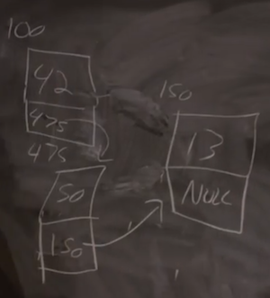
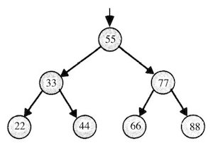
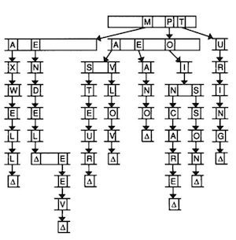

# Lecture 4
{:.no_toc}

* TOC
{:toc}

## Tools for debugging

* We took a look at CS50 IDE, a new web-based programming environment. We learned to use:
  * `check50` to check our work automatically
  * `debug50` and the debugger to step through our code
  * `help50` to make compilation errors more understandable
  * `printf` to print out helpful information as our program runs
  * `style50` to check the style of our code
* We also looked at how memory is used by our programs in C, and how we can allocate and free memory.

## `valgrind`

* `valgrind` is a command-line tool that we can use to run our program and see if it has any memory leaks.
  * Recall that a memory leak happens when we call `malloc` to ask the operating system for memory for our program, but we don't call `free` to mark it as free. Then, our program will use more and more memory as it runs, eventually slowing down or even crashing our entire computer.
* Let's write a program called `memory.c` to experiment a little bit:
  ```c
  #include <stdlib.h>

  void f(void)
  {
      int *x = malloc(10 * sizeof(int));
      x[10] = 0;
  }

  int main(void)
  {
      f();
      return 0;
  }
  ```
  * We have a function, `f`, that allocates memory for 10 integers, and using `x` as a pointer to the address of the start of that memory. Then, we try to access the 11th integer with `x[10]` (remember that pointers can act like arrays, since the memory we get is contiguous, or back-to-back).
  * When we run this program, we can see that it still works. It turns out, `malloc` sometimes (but not always) gives us back a little more memory than we ask for, and we might get lucky and be able to access and use memory beyond the bounds of what we should have.
* We can run our program with `valgrind ./memory`, and we see a lot printed out. But we do see one error message in particular, `Invalid read of size 4`, followed by some pointers in hexadecimal. We see `f (memory.c:15)` in the line immediately after, which tells us that this happened in line 15 of `memory.c` in the function `f`.
* We can also use `help50 valgrind ./memory`, which will distill the output for us, one error message at a time, and add additional clues to guide us.
* If we fix our program to access `x[9]`, then `valgrind` onluy has 1 error message for us: `40 bytes in 1 blocks are definitely lost...`. And `help50` tells us that we forgot to free memory we allocated with `malloc`, so we should call `free(x)` after we're doing using it. Now, we have 0 errors.
* Recall that we have some finite number of bytes in memory, and our operating system keeps track of which bytes are used by which program, which bytes are free, and indicates segmentation faults when we try to access memory that isn't allocated to our program.

## Other debugging methods

* Rubber duck debugging is the process of explaining our code, step-by-step, to a rubber duck (or some other inanimate object), so we ourselves can understand it better and hopefully realize where we might have a bug or opportunity of improvement. Hopefully, this will be another simple, but powerful, tool for us to use.
* Hand tracing is the process of simulating the execution of code by evaluating the value of every variable, line by line, to see if it produces the expected output.
* Visualizations too, can provide some insight into the processes occurring in your code to help you track down bugs, albeit more visually.

## More from last week

* We learned, last week, that a `string` is a synonym for `char *`, a pointer to a character.
* We also learned that memory is laid out in a certain way for our program, where different regions are used to store different types of data, such as:
  * the text segment, where the machine code for our program is loaded when we start it
  * the heap, where dynamically allocated memory (memory we allocate when the program is running), stores
  * the stack, where local variables and functions, including our `main` function, live when our program is running
* We saw a `swap` function that didn't work, when values were passed in directly, since it got its own copies of those values. Then, we saw a `swap` function that took in the addresses of two variables, so those values could actually be swapped.
* Binky, from the short clip we saw, also demonstrated how we could dereference pointers and use them correctly (and incorrectly). We need to make sure that our pointers have a valid address, before we try to dereference them.
* Finally, we saw an introduction to structs, where we can build our own data structures, with variables of our choice.

## Structs

* Let's make a file called `struct.h`:
  ```c
  typedef struct
  {
      char *name;
      char *dorm;
  }
  student;
  ```
  * This is a header file, which we can share among various `.c` files.
* In `struct0.c`, we import the header file:
  ```c
  #include <cs50.h>
  #include <stdio.h>
  #include <string.h>

  #include "struct.h"

  int main(void)
  {
      // Allocate space for students
      int enrollment = get_int("Enrollment: ");
      student students[enrollment];

      // Prompt for students' names and dorms
      for (int i = 0; i < enrollment; i++)
      {
          students[i].name = get_string("Name: ");
          students[i].dorm = get_string("Dorm: ");
      }

      // Print students' names and dorms
      for (int i = 0; i < enrollment; i++)
      {
          printf("%s is in %s.\n", students[i].name, students[i].dorm);
      }
  }
  ```
  * Notice now that we have a `student` type, and an array called `students` with structs of that type.
  * Then, we can access variables inside each `student` struct with the `.` notation.
  * A `student` is like an abstraction, where we encapsulate some variables together.

## Linked Lists

* So far, arrays had to be a fixed size at the time of initialization. If we wanted to add to our array, we would have to initialize a bigger array, and copy the values from the original array. But the running time of resizing an array is now _O_(_n_), where _n_ is the size of the original array.
* We can use a function called `realloc`, which reallocates memory. We can pass in the address of our memory and the new amount we want, and our operating system will return a new address, where we have that much contiguous memory. It will also copy the array for us to the new location. But this operation will cost a linear amount of time, too, depending on how big our array is.
* We can do the opposite, and ask for just enough memory for one element, like one integer, at a time. But they might be stored anywhere in the heap, so we need a way to link each element to the next, via a stored pointer.
* With this data structure, called a linked list, we lose the ability to randomly access elements. For example, we can no longer access the 5th element of the list by calculating where it is, in constant time. (Since we know arrays store elements back-to-back, we can add 1, or 4, or the size of our element, to calculate addresses.) Instead, we have to follow each element, one at a time.
* And we create a linked list by allocating, for each element, enough memory for both the value, and a pointer to the next element. We'll call these nodes:<br>
  
  * We have three nodes at various addresses in memory, `100`, `150`, and `475`. Each node has the value we want to store, and also a pointer to the next node. The final node has a pointer of `NULL`, indicating the end of our linked list.
* In code, we might create our own struct called `node`, with an `int` and a pointer to the next `node` called `next`:
  ```c
  typedef struct node
  {
      int n;
      struct node *next;
  }
  node;
  ```
  * We start this struct with `typedef struct node` so that we can refer to a `node` inside our struct.
* With some volunteers, we demonstrate how a linked list works. To store 3 values, we need 3 nodes, and a pointer, that we labeled "first", pointing to the first node. Each node holds a value, along with a pointer to the next node. And to add a node, we would allocate memory for a new node, and change our pointers carefully. First, we need to find the next node that will follow the new node (if we want to keep our linked list sorted). Then, our new node will point to the next node, and change the node before it to point to the new node. And to find the right place for inserting a new node, we have to start with our "first" pointer, and look at the values of each node as we follow the pointers in them.
* The running time of inserting a node, now, is _O_(_n_), since we have to follow each node to check their values. There's more logic and running time, but we don't need to decide on a fixed size for our list now. And if we were to insert nodes in unsorted order, the running time would be _O_(1), since we can just add it to the front of the list. We can also keep an additional pointer to the last node, calling it "last", or we can even have each node store two pointers, one to the previous node and one to the next node, so we can move forwards and backwards.
* Let's see how we might do this in code. First, we can store a fixed number of integers in an array:
  ```c
  #include <cs50.h>
  #include <stdio.h>

  int main(void)
  {
      // Prompt for number of numbers
      int capacity;
      do
      {
          capacity = get_int("Capacity: ");
      }
      while (capacity < 1);

      // Memory for numbers
      int numbers[capacity];

      // Prompt for numbers
      int size = 0;
      while (size < capacity)
      {
          // Prompt for number
          int number = get_int("Number: ");

          // Add to list
          numbers[size] = number;
          size++;
      }

      // Print numbers
      for (int i = 0; i < size; i++)
      {
          printf("%i\n", numbers[i]);
      }
  }
  ```
  * We get a `capacity` from the user, and create an array of size `capacity`. Then, we keep adding numbers to the array, until we reach the capacity. Then, we print each number in the array.
  * But our program is limited to a capacity we choose initially.
* We can size an array dynamically:
  ```c
  #include <cs50.h>
  #include <stdio.h>

  int main(void)
  {
      // Memory for numbers
      int *numbers = NULL;
      int capacity = 0;

      // Prompt for numbers (until EOF)
      int size = 0;
      while (true)
      {
          // Prompt for number
          int number = get_int("Number: ");

          // Check for EOF
          if (number == INT_MAX)
          {
              break;
          }

          // Check whether enough space for number
          if (size == capacity)
          {
              // Allocate space for number
              int *tmp = realloc(numbers, sizeof(int) * (size + 1));
              if (!tmp)
              {
                  if (numbers)
                  {
                      free(numbers);
                  }
                  return 1;
              }
              numbers = tmp;
              capacity++;
          }

          // Add number to list
          numbers[size] = number;
          size++;
      }

      // Print numbers
      printf("\n");
      for (int i = 0; i < size; i++)
      {
          printf("%i\n", numbers[i]);
      }

      // Free memory
      if (numbers)
      {
          free(numbers);
      }
  }
  ```
  * We get one number at a time,
  * First, we initialize a pointer called `numbers`, but we don't initialize it yet. We track the `capacity` of our array, as well as the `size` of the array so far.
  * Then, we get one number at a time from the user. `get_int` will return `INT_MAX` if we indicate EOF, or "end of file" as the end to our input (control + d in the terminal), so if that happens, we can `break` out of the loop.
  * If we've reached our `capacity` for the `numbers` array, we use `realloc` to reallocate enough space for an additional integer in the array. We check that `realloc` returned a pointer that isn't null, and if not, `free` the existing `numbers` array if we have one, and `return 1`. If we do get enough space, then we can add the new number to the array.
  * Finally, we can print each number in the array, and free the array. If not, running `valgrind ./list1` will show us an error.
* Now let's write the same program, using a linked list:
  ```c
  #include <cs50.h>
  #include <stdio.h>

  typedef struct node
  {
      int number;
      struct node *next;
  }
  node;

  int main(void)
  {
      // Memory for numbers
      node *numbers = NULL;

      // Prompt for numbers (until EOF)
      while (true)
      {
          // Prompt for number
          int number = get_int("number: ");

          // Check for EOF
          if (number == INT_MAX)
          {
              break;
          }
   ```
   * The beginning of our program is essentially the same, though we define `node` at the top of this program.
   ```c
          // Allocate space for number
          node *n = malloc(sizeof(node));
          if (!n)
          {
              return 1;
          }

          // Add number to list
          n->number = number;
          n->next = NULL;
          if (numbers)
          {
              for (node *ptr = numbers; ptr != NULL; ptr = ptr->next)
              {
                  if (!ptr->next)
                  {
                      ptr->next = n;
                      break;
                  }
              }
          }
          else
          {
              numbers = n;
          }
      }
  ```
  * Now, we allocate enough memory for a new node and point to it with a pointer `n`. If `n` was null after we called `malloc`, then we exit with an error. With the `->` syntax, we can follow a pointer to get a variable in a struct, so we store the new number into the node `n` points to, along with `NULL` for the `next` pointer. (If `n` was a node and not a pointer, we would use the `n.number` syntax.)
  * Then, if `numbers` is a pointer, we create a temporary pointer `ptr` to follow our linked list. We start with `ptr = numbers`. Inside our loop, if `ptr` doesn't have a `next` pointer (i.e. it's the last node in our linked list), we set the `next` pointer to `n` and break. Otherwise, our loop continues, and our temporary pointer `ptr` becomes `ptr->next`, i.e. we look at the next node.
  * If we didn't have an existing `numbers` pointer, we can just set it to `n`, or the start of our new list.
  ```c
      // Print numbers
      printf("\n");
      for (node *ptr = numbers; ptr != NULL; ptr = ptr->next)
      {
          printf("%i\n", ptr->number);
      }

      // Free memory
      node *ptr = numbers;
      while (ptr != NULL)
      {
          node *next = ptr->next;
          free(ptr);
          ptr = next;
      }
  }
  ```
  * Finally, we print the numbers by following the linked list in the same way, and we also free each node as we follow its `next` pointer.

## More data structures

* If we had an unsorted array or linked list storing names, we would have to look through each value, one at a time.
* We, as humans, might make smaller lists where each person whose name starts with "A" will be in one list, "B" in another, and so on. We can represent this concept with a *hash table*, where each value to be stored is _hashed_ by a _hash function_. The resulting _hash_ might be a number, and in this case might be `0` for a string that starts with `A`, `1` for a string that starts with `B`, and so on, but the important part is that we can use that number to index into some array. The array, in turn, will have a linked list for each letter of the alphabet (or more generally, a linked list for each _bucket_), and so this data structure is called a hash table.
  * Now, each linked list (in our example of strings) will only be, on average, 1/26th the size of a list with all the strings together. In the worst case, all the strings will end up in the same bucket (if they happen to start with the same letter), and we would have _O_(_n_) running time, like an unsorted array. We can also use a different hash function, which might distribute our elements more evenly. But in the real world, our running time is likely to be much lower with a hash table. And we can even have more buckets in our hash table, so each list is an even smaller proportion.
* A *tree* is another data structure where each node points to two other nodes, one to the left (with a smaller value) and one to the right (with a larger value):<br>
  
  * Now, we can easily do binary search, and since each node is pointing to another, we can also insert nodes into the tree without moving all of them around as we would have to in an array. Recursively searching this tree would look something like:
  ```c
  typedef struct node
  {
      int n;
      struct node *left;
      struct node *right;
  } node;
  ...
  bool search(int n, node *tree)
  {
      if (tree == NULL)
      {
          return false;
      }
      else if (n < tree->n)
      {
          return search(n, tree->left);
      }
      else if (n > tree->n)
      {
          return search(n, tree->right);
      }
      else {
          return true;
      }
  }
  ```
* We can use another data structure called a *trie* (pronounced like "try", and is short for "retrieval"):<br>
  
  * Imagine we want to store a dictionary of words efficiently, and be able to access each one in constant time. A trie is like a tree, but each node is an array. Each array will have each letter, A-Z, stored. For each word, the first letter will point to an array, where the next valid letter will point to another array, and so on, until we reach something indicating the end of a valid word. If our word isn't in the trie, then one of the arrays won't have a pointer or terminating character for our word.
* In our upcoming problem set, we'll use what we've learned about pointers and data structures to implement a spell-checking program, and gain an understanding of how something that might work at a low level.
