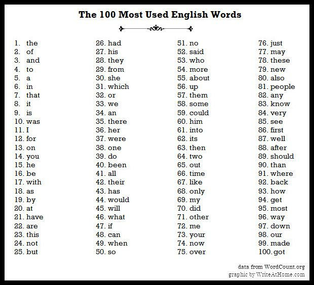
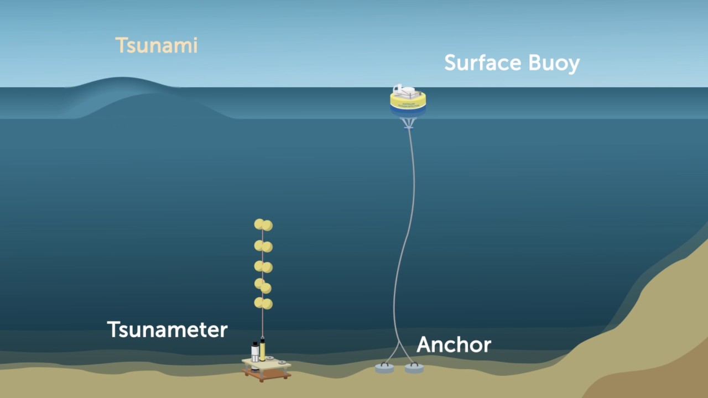
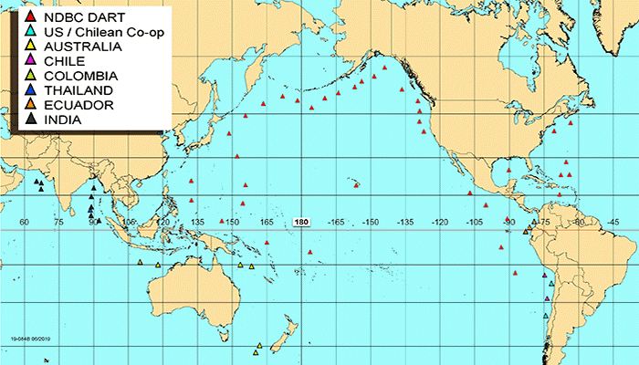
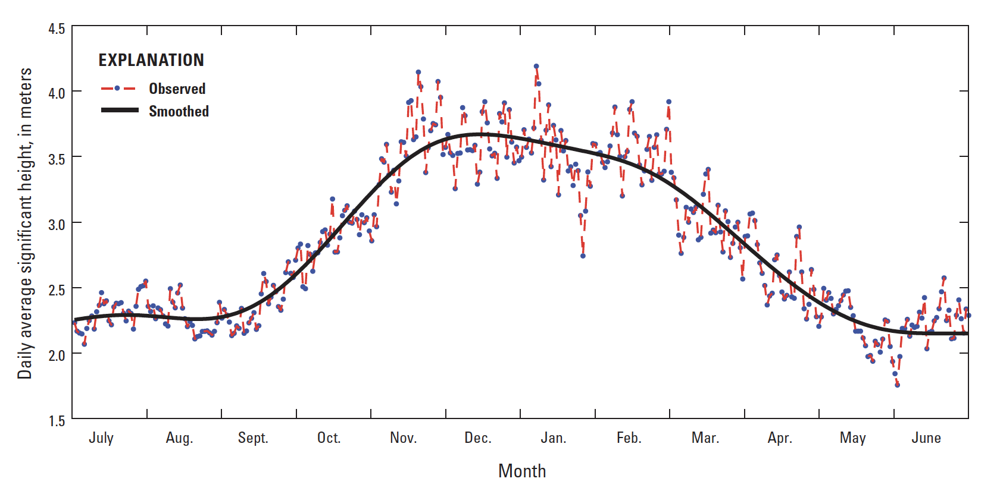

# Ananlyzing Data
{:.no_toc}

* TOC
{:toc}

## Preprocessing Data

When working with data, it is likely that we'll have to manipulate it or preprocess it in some way before we're able to analyze it. Over time humans have developed different methods to analyze data varying in ease of use. One such example is manipulating data in an Excel spreadsheet or Google Sheet versus manipulating data in a database textually with a language like SQL. Ultimately, the choice is yours on which tool you're comfortable using for the most part. When we start looking at larger data sets, we'll also need to consider which tools can handle that data sets of that scale.

Let's say we want to articles submitted to a scholarly journal to get published. Well we may want to programmatically iterate over their abstracts to get a sense of what words or topics occur most frequently. We'll need to consider a few things before we can start analyzing.

#### 1. Cleaning data
  * If we are trying to get a sense of topic-based words we'll need to get rid of some words that are irrelevant like "the", "of", "it", etc. These are referred to as "stop words".

  
  
  * We also might want to consider treating capitalized words the same as their lowercased equivalents. This step can vary based on how the data is collected. Are users selecting items from a drop down menu or multiple choice? Or are they writing answers in an open field?
  * If we really wanted to be fancy we could lemmatize the data set, which means we would only be working with root words. Words like "run", "ran", "runs", and "running" would all count as the same word.
  * These methods allow all of our data to be uniform so that it is easier to analyze, without changing the primary data.
  * It is likely that we won't catch all the aspects of our data that needs to be cleaned in our first pass. After we start analyzing we may see patterns we want to eliminate or explore further. We can iteratively clean our data throughout this process to make sure we are analyzing uniform data.

#### 2. Incomplete or missing data
  * If we're analyzing abstracts, how do we handle papers that have incomplete or missing abstracts?
  * Do we eliminate all papers without abstracts from our sample? Do we use a sample from the paper itself? It is ultimately up to you, the programmer, to decide this.
  * Be sure to be consistent with how you handle these data points!

#### 3. Invalid data
  * Our data set could contain words of different languages using special symbols that our programming environment may not be able to display.
  * In some programming environments, these characters may be represented as their Unicode equivalent. How do we handle such words when we analyze them?
  * Do we remove them from our data set? Do we translate them to some English translation?
  * Again, the key is to be consistent!

#### 4. Combining data sources
  * In order to find themes across all abstracts, we'll have to look at all the papers' abstracts.
  * We may want to copy all the abstracts from the papers into one file to make analysis easier.
  * Additionally, there may be cases were some papers have the abstract included as a separate file as opposed to included in the same file as the entire paper.

## Extracting Information

The raw data we collect from devices will seldom (if ever) tell us what do with it. It is our job to interpret it and make decisions based on those interpretations.

Raw data is a collection of numbers, text, or values. We can collect information, that is the patterns or facts the data presents, by analyzing this data. For example, if our data was a collection of words from an article we could easily extract a fact like what word was used most frequently. If we used more articles from the same author we might find patterns in their writing style that we couldn't otherwise see in just one document.

Sometimes we want to collect data over a period of time instead of just once. In this way we are able to determine trends over time. Remember our [buoy example](../../collecting_data/notes/#signals)?

It wouldn't make sense to only collect this data once and be done with it. We could imagine a database that stores all the values of relative distance between the surface buoy and the anchor once every second or 5 times a second if we wanted to be even more precise. Even with all this raw data a computer can't determine what is normal and what is not. We, as the human, would need to determine a range of values that we consider to be normal, or a baseline.

We could further extrapolate that any value outside of this range might indicate a storm or a tsunami. This is called correlation. We can observe storm like conditions when the relative distance changes dramatically or falls outside of the range we've deemed to be "normal". Correlation does not always imply causation, though, consider other factors that could change a buoy's relative distance to its anchor, such as animals, humans, or boats.

If we really wanted to confirm our hypothesis that a storm may be on its way we would probably want to use more than one data source, or buoys in this case. That way we can rule out external factors that may be occurring at one location. We could use this network of buoys to gather even more information by programmatically comparing distances of neighboring buoys and taking the average, for example.

Ultimately the size of our data set will determine our conclusions and how confident we are in those conclusions. The larger the sample size, the smaller the margin of error. Imagine we asked 10 people what their favorite color was and all 10 said green. Our results would show that 100% of people chose green as their favorite color, but this would not be true of the population of the earth. If we sampled 1 million people, the distribution of favorite colors may be more representative of the larger population.

## Data Visualizations

When we look at data over long periods of time, it is often easier to see trends with some sort of visualization. Some examples include charts, diagrams, graphs, and infographics.

To view yearly trends of wave heights in the Pacific, we could take the daily average height for an entire year and manually skim over the data. This is something we'd likely have to do programmatically as our buoys are likely collecting various types of data like water temperature and wind direction so we'll need to extract wave height. Looking at all these numbers, even just for wave height seems tedious and we might miss overarching trends. Plotting this data on a graph, we can see greater wave height in the winter months than in the summer months.

