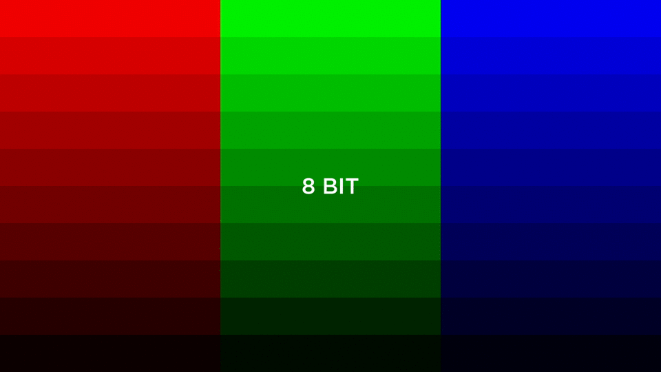
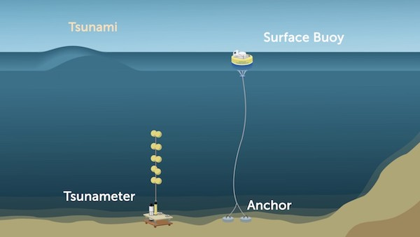
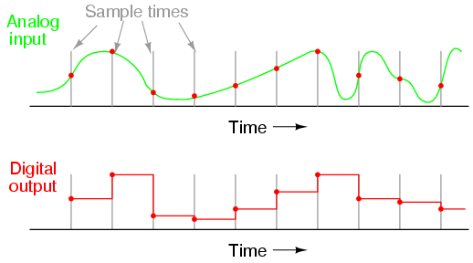
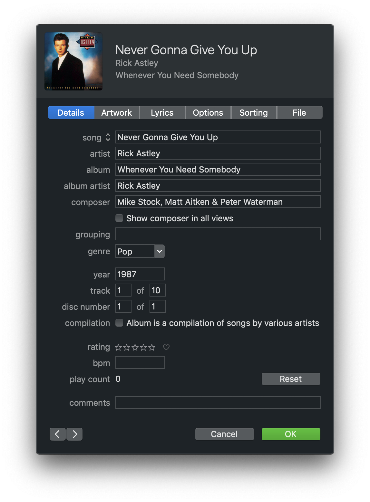
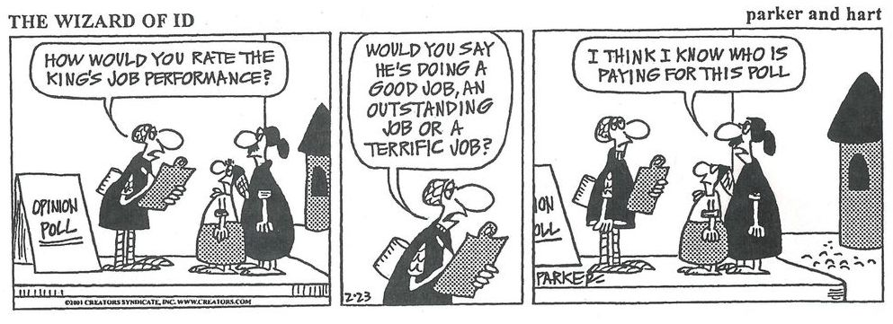

# Collecting Data
{:.no_toc}

* TOC
{:toc}

## What is Data Science

Data science can be defined as using data systematically to make decisions or obtain insight.

## Analog vs. Digital Data

Representing values in the real world digitally, isn't always as easy as it sounds. We've already seen how computers can't really store numbers like 1/3, but what other data do computers have difficultly representing?

Turns out computers rely on pixels to display images. Each pixel is made up of three values: red, green, and blue. These are called RGB values. Often times various hardware and software have different color palletes, or bit depths.

For example, if we were to represent an image using 8-bit color we would have access to 28 values or 256 distinct colors. If we were then able to use 24-bit color we'd have access to 224 values or 16,777,216 colors.

This notion of bit depth means that we can't actually represent all the colors we see in the real world digitally, rather we have to approximate them to the nearest value we can represent.

## Signals

A signal is one way of transmitting information from one device to another. Analog signals are continuous, meaning their values are constantly changing over time. Digital signals, however, are discrete, meaning that we capture a snapshot of the analog data over a specific time interval.

Consider a buoy in the middle of the ocean tied to an anchor. The distance between the anchor and the surface buoy is constantly changing because of wave activity.

If we wanted to measure this distance between the anchor and the buoy on the surface we would have to use a sampling technique. We could transmit its distance to a secondary device, like a Tsunameter, every second which could approximate its relative distance to the anchor. If we sample the analog signal more frequently we can more closely approximate the analog input.

## Metadata

When we collect or store data, we often want additional information about that data, also called metadata, to let a computer know how to interpret or display the data. If our data was a song in the form of an mp3 file our metadata might contain information like song name, track number, and album name. Then if we play this song on an mp3 player like an iPod that information could be displayed on the screen.

Changing the metadata does not affect the primary data (although it may affect how your computer interprets that data). Metadata for a song in iTunes might look something like this.

We could change the title of this song to be whatever we want, but that will not change how the song sounds when we play it. It will, however, affect how our music player organizes it in our library. The metadata here also makes songs easier to search for since most music players allow you to search fields of the metadata. For example, we could search for this song by searching for "Never Gonna Give You Up", "Rick Astley", or "Whenever You Need Somebody", etc. Imagine if we didn't have this information, we may have to skim through every song in our library or playlist just to find the song we want to listen to. The song still exists and sounds the same it is just significantly more difficult to find it or use our data.

Metadata is the reason we can sort or filter the music in our library or playlist. We can pull the metadata to sort our music by artist alphabetically, or look at all the tracks in a specific album.

## Data Collection

Collecting data is often the most daunting part of data science. Whether we are collecting data in person or online, biases can affect the data that we collect.

Data collection can be affected by response bias, that is how we ask a question can affect the answer. "How user-friendly was our platform?", insinuates that the platform was indeed user-friendly and making participants feel like any other answer is not the norm. Convenience sampling is another form of bias that affect data collection. If we only collect information from a specific group of people because it easy to do so our data won't be representative of the entire population.

When humans collect data, we can usually assume there will be some degree of bias. But surely computers can be more objective, right? Remember computers are only as objective as the algorithms they are running and who created those algorithms, you guessed it, humans.

Let's consider an example. Say we want to design a machine learning algorithm to determine which recommends resumes employers for a particular job. Well, we'll need a training set for our algorithm to learn from, this would likely be in the form of some data on what resumes resulted in getting hired for similar jobs in the past. If past employers were prejudice towards a particular gender, ethnicity, or group, your algorithm would reflect the same forms of prejudice. This is just one way bias can be embedded in an algorithm, but bias can exist at every level of software development. It is your job as the developer to be aware of of this to reduce bias in your own work.
