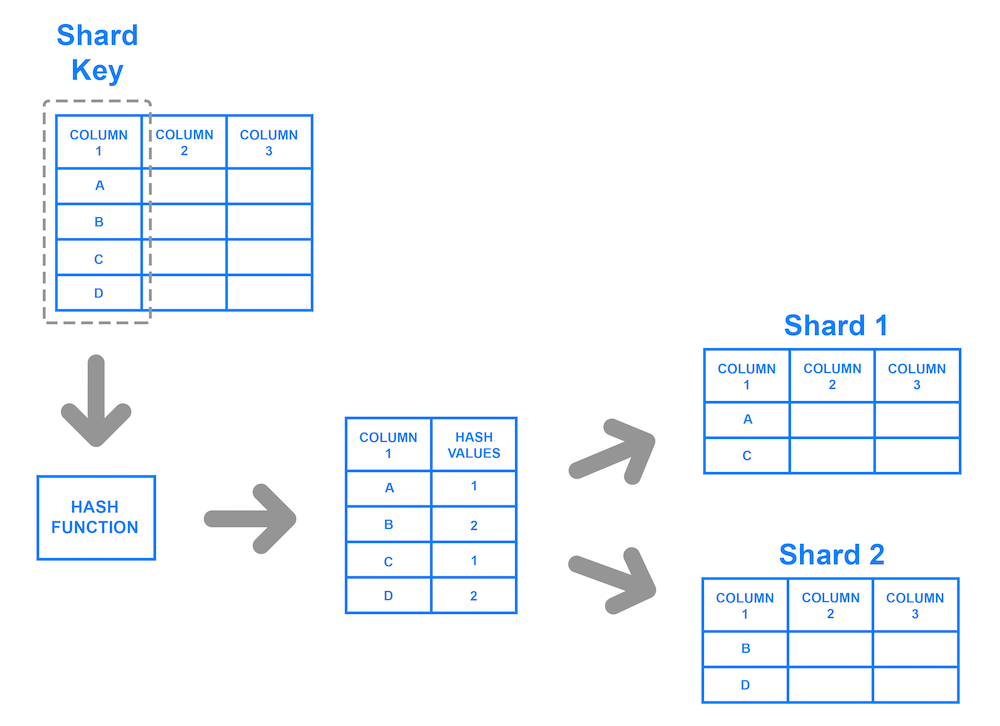
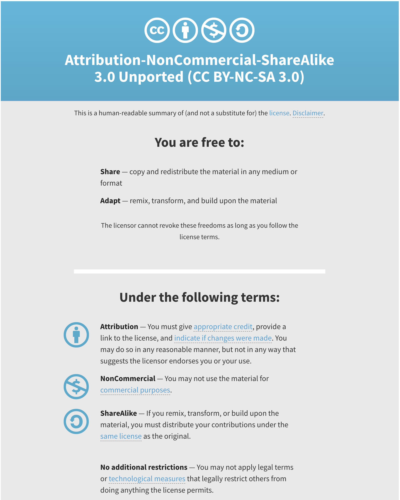

# Impact of Computing
{:.no_toc}

* TOC
{:toc}

## Developing Computational Artifacts

More often than not, developers work in teams to accomplish a shared goal. There are various models for collaboration such as pair programming, consultation for debugging, and splitting front end and back development. This idea of compartmentalizing code into various independent parts is called modularity. This allows us to easily add or modify existing projects without having to rewrite the entire thing from scratch. Imagine if every time our computers broke we had to buy an entirely new one. This may be the case, but if we can identify which part is broken or faulty we can replace just the broken component, saving us money and time.

Collaborating with others is about more than just programming. You have to communicate with one another about the design of the program. You'll also have to consider the inputs and outputs each of you expect for your portion. You may not always agree so conflict resolution will be key to navigating the project. You'll need to negotiate and ultimately come to some consensus with your team.

Although it is nearly impossible to consider all the ways your computational artifact can be used, it is important to consider the various ways it can be used both intentionally and unintentionally. These users could potentially have positive or negative effects on your project as a whole. For example, the world wide web was originally designed to provide a quick way to share information to the scientific community. Had users only used this technology for that purpose, we would not have the extensive access to resources that we do today, furthermore other fields such as medicine, engineering, communications, and the arts would have missed out on this technology since they were not the intended audience.

## Scaling

Scalability is a program's ability to scale to accommodate larger data sets, or more generally, an increased work load. Scalability itself is not a discrete feature in a program but is a part of the design process, and is often a cooperation of software and hardware. As data sets grow, and thus increase the work load of a program, it becomes increasingly more important to consider program or database's ability to accommodate any increase in data.

Large increases in users and data usually prompt businesses and developers to consider more scalable options. Consider if Facebook only used a database that could only store 10,000 rows of user information. That may have seemed like a lot when they started implementing their platform but over time usage grows and the need for more space becomes a necessity. One way that companies have handled their large user databases is with a concept known as sharding. This allows us to store a database in multiple databases using a shared key.



## People and Computers

Behind all the technology we use and interact is a person or, more likely, a team of people. The development of these new technologies have changed our lives drastically. Perhaps you remember rotary phones or landlines more generally.


Landlines were physically connected to a telephone line. In the 1940s, companies like AT&T and Motorola developed mobile phones that were essentially just two-way radio signals.


It wasn't until the early 90s that companies started integrating other features that we now consider trivial, like calculators and text messaging.

In this day and age, most everyone has a cell phone. Just like any other convenience, this technology too, comes with a cost. The average American spends about four hours on their phone in a day! While the original developers likely anticipated certain outcomes like more frequent communication with others, it seems unlikely that they anticipated the rate at which we would use them for things other than calling and texting.

## Solving Other Problems at Scale

Just as we have distributed computing solutions, whereby we can solve problems more efficiently by allowing multiple machines to run different tasks, we can have distributed science. Using technology, research can be carried out by people all over the world who can contribute data via their own computing devices. This is called citizen science.

In this way, other fields outside of computer science have developed more efficient and accurate systems to identify problems or concerns and develop and test solutions. Moreover, we can share these results with more people than we otherwise could have.


Platforms like Kickstarter and GoFundMe have adopted to similar models to fund all sorts of projects via their website. They use what's referred to as crowdsourcing to connect start ups, social causes, and other organizations with funding. Each platform has a slightly different model but generally people see a product or cause they want to fund and contribute some amount of money (predetermined or otherwise). Over time more people contribute and eventually the group might reach their goal that they may have otherwise been able to do with a single funder.

## Models and Simulations

Computer programs can be used to create models and simulations, to test hypotheses and generate new understanding and knowledge. Simulations can model existing knowledge (like finding the area of a circle) or help us explore phenomenon that could happen in the future (like predicting the damage caused by a natural disaster). Simulations are applicable in everyday life, from testing new car designs to modeling possible furniture arrangements. Taking advantage of simulations as a tool can help people and companies save time, money, and effort by modeling new ideas before putting them into production. We can often use simulations to model phenomenon that would be difficult given the constraints of the real world. If we wanted to simulate the trajectory of a rocket through space, that would be impossible because of the Earth's gravitational pull.

### Monte Carlo Simulation
<iframe class="scratchpad" frameborder="0" height="420" scrolling="no" src="https://www.khanacademy.org/computer-programming/monte-carlo-finding-the-value-of-pi/6530004791197696/embedded?embed=yes&amp;article=yes&amp;editor=no&amp;buttons=no&amp;author=no&amp;autoStart=yes&amp;width=610&amp;height=420" width="610"></iframe>

Developing simulations take on a similar life as developing programs. It is unlikely that one could build a simulation to model a complex system all at once, top to bottom. We might try to modularize the system and design one part of it first. We could also simplify some of the underlying functionality of our simulation and get that part to work before building on top of that. Remember that just like our programs, bias can be embedded into the simulations we build depending on what assumptions and simplifications we make.

Aside from the mathematical equations that we may want to use in a simulation, we may also want to incorporate some degree of randomness. If there is a 30% chance of picking a winning ticket in a lottery, we could model this using a random number generator (also called an RNG)[^1]. We can write this program such that the RNG would output any number between 0 and 9, where 0, 1, and 2 represent a winning ticket. The output every time this program ran would be different. We could implement this in C with the [`rand()`](https://man.cs50.io/3/random) and [`srand()`](https://man.cs50.io/3/srandom)functions. In `rand()`'s documentation, we can see that `rand()` actually produces the same random numbers on every run, unless we specify a "seed" or initializer using `srand()`.

```c
#include <stdio.h>
#include <stdlib.h>
#include <time.h>

int main(void)
{
    // Use current time as seed for random generator
    srand(time(0));
    // Picks a number between 0 and 9
    int ticket = rand() % 10;
    // Prints the ticket number
    printf("%i \n", ticket);

    // Decides fate
    if (ticket < 3)
    {
        printf("You won!\n");
    }
    else
    {
        printf("You lost!\n");
    }
}
```

## The Digital Divide

The digital divide describes the disparity between those who have access to technology and those who do not, including but not limited to access to a computer, the internet, or other hardware and software. It even more broadly describes the uneven distribution of usage between groups by socioeconomic status, race, gender, and geographical location. But it isn't just groups that are affected by the digital divide. Within a group or community too, there are individuals who do have access or have limited access to computers and the internet.

There are many factors that contribute to the digital divide, such as:
  * physical accessibility
  * financial accessibility
  * accessibility for individuals with disabilities
  * cognitive accessibility
  * etc.

Solutions are rarely addressed at scale because because there is often "bigger fish to fry". Human needs such as food supply and health care take precedence over digital inclusion.

When we consider technological resources and solutions, we need to consider who has access? Who benefits from this technology? Furthermore, are these concerns that are occurring locally for a particular solution or globally? Ultimately, we as individuals along with organizations and governments have the power to improve or worsen this divide.

## Ethics and Legalities of Computing

Intellectual property refers to creations of the human mind. Things like trademarks, copyrights, and patents are all forms of intellectual property. Digital content is also subject to the laws around intellectual property. Content created on a computer is considered the intellectual property of the creator or organization.

Technology has made it easier than ever to create and distribute our creative works, but this is a two way street. With ease of access and distribution comes ease of unauthorized use and modification. Tools like BitTorrent and LimeWire are some such tools that enabled to peer to peer sharing of files, which were typically illegal copies of music, movies, and other digital media. This often brings up well warranted concerns of ownership, value, and use when it comes to digital information. Do you really own a movie that you purchased on Amazon Prime, or that song you bought on iTunes? If you then burn that to a disk or flash drive and give it to a friend, do they also have ownership of that property? You may seen a warning like the one below shown before the start of a movie. This is one measure taken to make user's aware of the legal implications of unauthorized use.


In a professional setting, most companies and organizations have employees sign contracts with an intellectual property clause. Typically, digital content you produce on the job is the property of the company or organization. Even in a personal setting it is a good idea to consider different measures to safeguard your own intellectual property. This could be as simple as encrypting your data or storing it somewhere that has taken other measures to protect your data.

## Legal Use

There are ways to use others work legally. These products are typically labelled as open source or open access or licensed under the Creative Commons license. These licenses and labels allow us access to information that we may not have had access to otherwise, as well as contribute to this base of information for others to use.

CS50's own curriculum is licensed under the Creative Commons' Attribution-NonCommercial-ShareAlike license. In short, anyone can use, share, or modify our work legally, so long as they credit us and distribute their work under the same license.



The term open source is used to describe programs that are not only free to access and use but also to modify and extend for any purpose. Python is considered an open source software. People are continuously building and adding other features and modules to adapt it to their needs.

Open access refers to research output that is free of any and all restrictions. The [Digital Public Library of America](https://dp.la/) for is one such example, whereby users have access to millions of multimedia resources without restriction.

Regardless of how the information or material is licensed or labelled, it is a good idea to cite all sources, just as you would in a paper in your English class. Simply supplying a link to the site in a comment of your code can suffice.

---

[^1]: In the exam reference sheet for the AP CSP exam, the syntax for a random number generator is `RANDOM(a, b)` where the return value is any number between `a` and `b`, inclusive.
