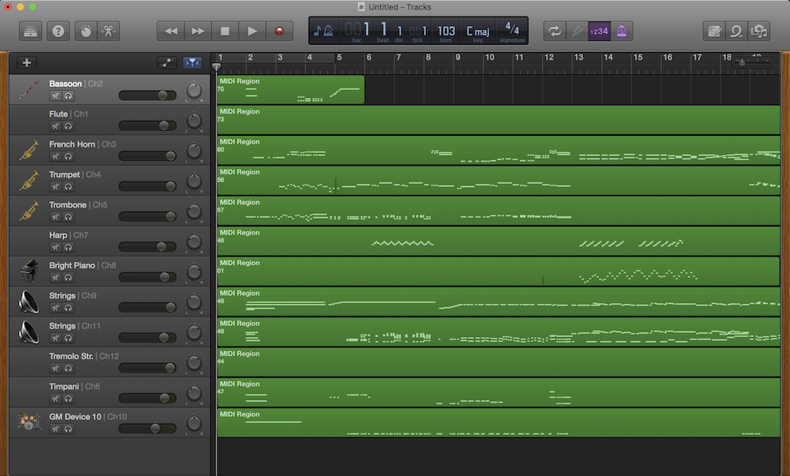
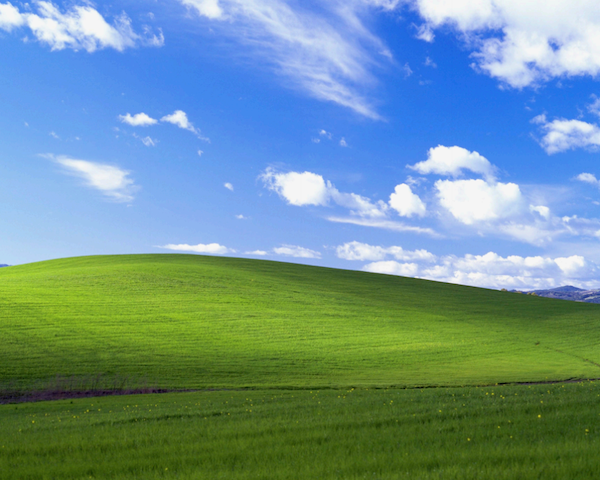
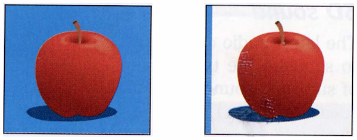
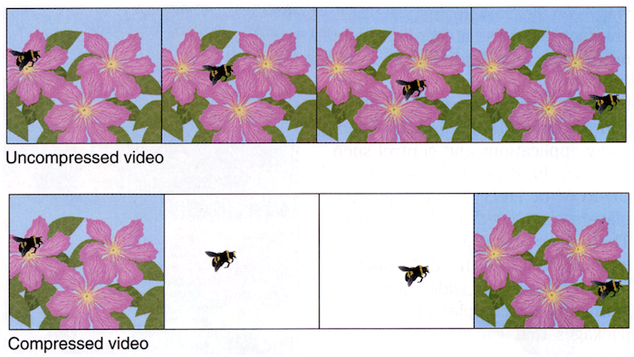
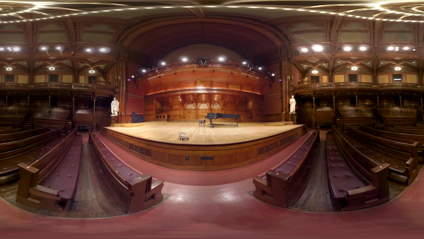

# Multimedia
{:.no_toc}

* TOC
{:toc}

## Introduction

- Odds are you use it everyday, but what is it?

## Audio

- Computers are good at recording, playing back, and generating audio
- Uses different file formats
  - File formats are just a way of storing 0s and 1s on disk so that certain software knows how to interpret it
- MIDI
  - Way of storing musical notes for certain songs
  - Can do this for different instruments
    - Programs can render the notes for these instruments
- GarageBand
  - Included with macOS

   

  - This is the Star Wars theme in MIDI
    - Doesn't sound quite as good as the actual version
    - Computer synthesizes the notes
      - Not an actual recording
      - Computer interprets notes in the MIDI file
- MIDI is common in the digital workspace among musicians who wish to share music with each other.
- Humans typically like to hear music preformed and recorded by humans
  - File formats for recorded music include:
    - AAC
    - MIDI
    - MP3
    - WAV
- WAV is an early sound format, but still used
  - Uncompressed data storage allowing high quality
- MP3
  - File format for audio that uses compression
    - Significantly reduce how many bits are necessary to store a song
    - Discards 0s and 1s that humans can't necessarily hear
      - True audiophiles may disagree
    - Trade off between optimizing storage space and sacrificing quality
    - This compression is said to be lossy
      - Losing the quality in the compression process
- AAC
  - Similar to MP3
  - May see when you download a song from iTunes
- Streaming services such as Spotify don't transfer a file to you but rather stream bits of information to you
- How do we think about the quality of these formats?
  - Sampling frequency
    - Number of times per seconds we take a digital snapshot of what a person would hear
  - Bit depth
    - Number of bits used for these individual snapshots
  - Sampling frequency x bit depth = number of bits necessary to store one second of music
  - Audio file formats allow you to modify what these parameters are

## Graphics

- A graphic, what we see with multimedia, is really just a bunch of pixels both horizontal and vertical
  - All file formats are rectangular in nature, though transparent pixels can make images look to take on other shapes
  - In the simplest form, each of the dots or pixels is a bunch of 0s and 1s

    

  - To create a file format, we just need to determine a mapping
- This image is only black and white, so how to represent color?

## RGB

- RGB stands for Red Green Blue
  - With information giving an amount of red, an amount of green, and an amount of blue, you can tell a computer how to colorize pixels
  - None of the colors yields a black pixel
  - All of the colors yields a white pixel
  - In between these two options is where we get all sorts of colors
- Consider the three bytes: 11111111 00000000 00000000
  - If we interpret these bytes to represent colors, it appears we want all of the red, none of the green, and none of the blue
  - These 24 bits (3 bytes =  3 x 8 bits = 24 bits) represent the color we know as red!
    - If a computer wanted to represent this color, it would store these 24 bits
- Consider the three bytes: 00000000 11111111 00000000
  - Green
- Consider the three bytes: 00000000 0000000 11111111
  - Blue
- Consider the three bytes: 00000000 0000000 0000000
  - Black
- Consider the three bytes: 11111111 11111111 11111111
  - White
- Can get many color variations by mixing the above colors in different quantities
- When we talk about image formats, we typically don’t talk in terms of binary but rather something called hexadecimal (base-16, contains 16 digits)
  - 0, 1, 2, 3, 4, 5, 6, 7, 8, 9, a, b, c, d, e, f
  - 0 is the smallest number we can represent in single digit
  - f is the largest number (value of 15) we can represent in a single digit
- Consider the 8 bits: 1111 1111
  - Each hexadecimal digit represents four bits
  - One hexadecimal digit can represent the first four bits, another can represent the second four
    - Represent something with eight symbols using only two!
  - 1111 is the decimal number 15, which is f
  - Therefore, 1111 1111 in hexadecimal is ff
- Red can thus be represented in hexadecimal as  ff 00 00 
- Green can be represented in hexadecimal as  00 ff 00 
- Blue can be represented in hexadecimal as  00 00 ff 
- A lot of graphical editing software such as Photoshop use hexadecimal to represent colors

## Bitmap Format

- This background for Windows XP was a bitmap file (.bmp)

  - A mapping or grid of bits much like the smiley face from before
- Zooming in on this image show that it is just a grid of dots

  - Notice the pixelation
- Much like with audio, so too in the world of images do you have discretion over how many bits to use
  - How many bits to represent each pixel's color?
  - Resolution is another factor
    - An image that is only 100 pixels scaled up only duplicates the existing limited information, resulting in a blotchy image
    - Would be better to start with image that has a higher resolution (more pixels)
- A lot of repeated colors, so it seems silly to represent each color with the same number of bits

## Image Compression

- Graphical file formats can often be compressed
- Can be done lossy or losslessly
  - With audio, we threw away audio information that the human ear can't necessarily hear
    - This is lossy compression; throwing information away
  - Using fewer bits to represent the same information is lossless compression
- Lossless compression

  

- There is a lot of repeated blue in the first image
  - Using the same 24 bits to represent each pixel!
- The second image is compressed and not what a user would see
  - The first column contains the color that the rest of the row (scan line) should have
    - Image contains instructions on how to repeat the color in a particular row
  - When a color is encountered that isn't in the first column (the apple in this case), the instructions would list the colors for each non-repeated pixel
  - This uses less bits but makes the original information recoverable
- Lossy compression

  

- This is a .jpg photograph that is somewhat compressed, but not easy to tell
- Let's say we want to compress this image further so that we can share it without going over a social media platform's limit
- It contains more complicated patterns of colors, so let's try a lossy compression resulting in the following:

  

- Lossy compression means that I won't be able to get that original image back
  - The compression throws away bits of information
    - "Does the sky really need this many shades of blue?"
    - "Does this leaf really need this many shades of green"
      - Replaces bits with only a few colors giving an approximation
      - I will not be able to know how clear the sky used to be from this information

## Image File Formats

- BMP
  - Originally used by Windows
  - Not super common these days
- GIF
  - Low quality images
    - Only supports 8-bit color
  - Often used for memes
    - Can be animated
    - Like a video file with only a few images

      

- JPEG
  - Supports 24-bit color
  - Losslessly compresses
    - Can minimize amount of compression to create high quality photos
- PNG
  - High quality graphics
  - Supports 24-bit color
- All these formats ultimately have an limited amount of information
  - Ultimate just store pixels and colors of when the image was taken

## "Enhance"

- Common for popular culture abuses of what it means to be a multimedia format
  - "Enhancing" means to make an image as clear as possible not matter what format it was saved in
- [David shows a clip of characters "enhancing" an image](https://video.cs50.net/cscie1a/2017/fall/lectures/multimedia?t=27m30s)
  - The characters zoom into a pixelated frame of a video and somehow clear it up to see a reflection
    - Video is just a whole bunch of images being shown to us quickly (24 frames per second, etc.)
  - The pixelated image only contains information for those pixels
    - There is no way to obtain a clear image unless the original image was already at a high resolution
- [David contrasts this with an aware clip of Futurama](https://video.cs50.net/cscie1a/2017/fall/lectures/multimedia?t=30m5s)

## Video Compression

- You can think of a video format as similar to a flip book
- Video formats are just a bunch of images shown quickly in succession to create the illusion of motion
  - Not necessarily all information stored as png, jpg, gif, or even images
  - Algorithms and mathematics can help go from one frame to another
- Opportunities for compression
  - Can leverage same image compression techniques for each frame (intra-frame coding)
  - Background of multiple frames can contain redundant information

    

  - Compare current frame and next frame of video and determine what has changed
    - Store these differences
    - Key frames store a snapshot of time to remember what the video looks like
    - In each subsequent frame remember what has changed
      - Using algorithms and math, background is drawn
    - Key frames are stored multiple times to guarantee that frames can be recovered

## Video File Formats

- In the world of video, there are more solutions on how to store information
- Video file formats are containers
  - Containers are digital container in which you can put multiple types of data
  - Can include a video track, audio track, a secondary audio track (for different languages), closed captions, ...
- AVI
  - Commonly used in Windows
- DivX
- Matroska
  - Open source container meant to be more versatile
- MP4
  - Pretty much universal in all browsers
- QuickTime
  - Commonly used in MacOS
- Codecs
  - Ways of storing and encoding information
  - For video:
    - H.264
    - MPEG-4 Part-2
    - ...
  - For audio:
    - Can be stand alone files or tracks in a container!
    - AAC
    - MP3
    - ...

## 3D Video

- Increasingly, 3D formats are becoming more common

  

  - This is a 360 degree image of Sanders Theatre
    - A spherical image
    - Looks distorted in 2D
    - Like flattening a globe
- Images can contain metadata
  - Information that viewers can't see
  - Tells programs, applications, and browsers how to display the image
- With sensors on a headset, users can experience virtual reality

  

- More file formats are still on the horizon, but ultimately all of them boil down to storing 0s and 1s!
