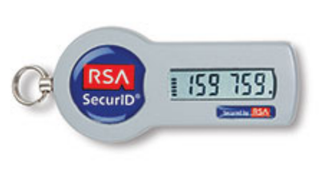
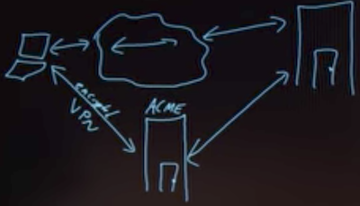
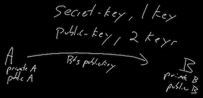
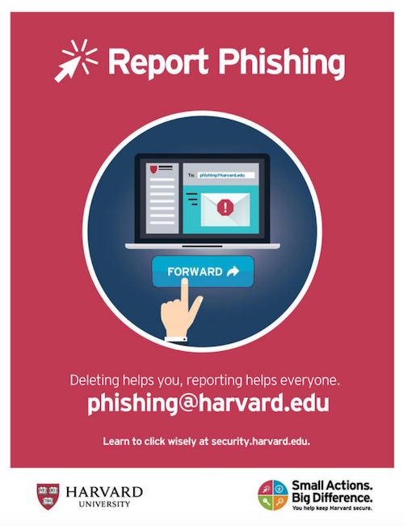

# Security
{:.no_toc}

* TOC
{:toc}

## Introduction

- Our data is under constant threat, but how can we defend ourselves?

## Privacy

- Keeping people away from things you don't want them to see
- Computers are among the least secure devices you own
  - Data or files are stored on them as 0s and 1s
    - Can be financial info, photos, or other personally identifiable information (PII), such as:
      - Social Security number
      - age
      - race
      - phone number
      - medical information
      - biometric information

## Deleting Files

- What does it mean to delete a file off of a hard drive?
  - Visually, it disappears from a desktop or folder
- Files are stored on a computer as 0s and 1s
- Some space needs to be allocated for the file
- The operating system has a file that keeps track of files an their location on disk
- Graphically, when a file is deleted, it moves to the trash (or recycle bin)
  - It can still be easily revived from here, until you empty the trash
- However, an operating system doesn't actually delete it from the hard drive
  - It simply forgets the location and existence of the file!
  - One can theoretically recover data by looking for familiar patterns of bits
- So how do we delete more securely?
  - Re-saving a file with overridden information actually could not override the old bits but rather create more 0s and 1s stored on a hard drive!
  - Special software can wipe data off of a hard drive
- Who do computers have this obvious flaw with deleting?
  - What if we accidentally delete a file?
    - This structure allows for recovery
  - Wiping data also takes a lot of time, so it's much faster to just forget locations of data

## Cookies

- A feature supported by HTTP
- Little values a web server puts on a user's browser
- Used to remember if a user has visited a website before
  - Allows you to not have to log in every time you visit or refresh a page
    - When you log into a web server, a cookie is planted on your browser
  - Stored in a database
  - Browser will send value to web server to remind of previous login
- When we make a request we send:
```
GET / HTTP/1.1
Host: example.com
```
- We receive:
```
HTTP/1.1 200 OK
Set-Cookie: session=29823bf3-075a-433a-8754-707d05c418ab
```
  - The server gives us a cookie.
- A cookie is like an ink-based hand stamp for an amusement park or club
- Wireless information can be intercepted
  - What if a hacker could obtain the cookie
    - Session hijacking attack
    - If you have already logged in, hacker can pretend to be you
- Encryption scrambles this value so hackers cannot easily use it
- Browser history remembers everywhere you've been and everything you've done there
  - Convenient if you want to recall a website you've visited
    - But, so can anyone else with access to your browser
- Can clear browser history and cookies
  - History likely not securely scrubbed
  - Will protect you from nosey friends
  - Websites will forget you visited as the cookies will be deleted as well!
- Search engines can use your history and  cookies to suggest targeted websites or products based on websites you've visited. This can be considered convenient but this information can also be sold or misused in a variety of ways both individually and at scale.
- Every convenience that these technologies offer us comes with a cost. We can have our browser store things like our shipping information or credit card number to make it that much easier to purchase things online, but if someone were to gain access to our machine, they too would acquire this information. This too, brings up ethical concerns. How accountable are companies for our data? What are their obligations to their users in regards to how their data is used and stored? Are these businesses intentionally trying to harm us by selling or distributing our data?
- Computing can even play a part in social and  political issues, like in 2018, when [Cambridge Analytica](https://en.wikipedia.org/wiki/Facebook%E2%80%93Cambridge_Analytica_data_scandal) harvested user Facebook data fro political advertising.

## Incognito Mode

- Can open up a typically different colored browser window
- Use if you want history automatically removed
- Useful when building a website as sometimes you want a browser to forget old iterations of your website build

## Authentication

- All of this assumes you log in
- If you don't use a passcode to protect your device, anyone can pretend to be you
  - What if you lose your phone or device?

## Passwords

- On a phone could only be a few digits
  - Not super secure
  - \__ \__ \__ \__
    - With numbers, each space has 10 options
    - 10 x 10 x 10 x 10 = 10,000 possibilities
    - 0000-9999
- On many smartphones, you will have to wait for an amount of time if you have entered a bad passcode
  - Slows down the process of someone guessing
- Add more digits or letters of the alphabet
 - Using a-z, A-Z, 0-9
 - \__ \__ \__ \__
  - Each space now has 62 options (26 + 26 + 10)
  - 62 x 62 x 62 x 62 = 14,776,336 possibilities
- Maybe you're super secure and you have a 20-char password
  - You could forget it
  - Annoying to type in repetitively
- No one fits all
  - Short = bad, longer = good
  - Don't use popular words and phrases
    - Hackers will look for words or common phrases
- Most common Passwords
  1. 123456
  2. 123456789
  3. qwerty
  4. 12345678
  5. 111111
  6. 1234567890
  7. 1234567
  8. password
  9. 123123
  10. 987654321
- Hackers have dictionaries of bad passwords that they can search through and try
- Random passwords
  - Usually have to confirm so it can be hard to replicate
- Using numbers to represent letter is common
  - 1 for l
  - 4 for A
- It's suggested you mix uppercase, lowercase, and and throw in numbers
  - Good to use misspellengs
- Don't put your post-it with your password on your monitor!
- Constant password changes can be a net negative
  - Can encourage easier passwords to help with memorization

## Password Resetting

- What if you forget your password?
  - Often can click on a link to reset your password
    - Asks you to type email address or username
  - Typically, you get an email with a link
    - Hopefully this goes back to the same website!
    - It likely has a random value in the URL
  - Once back at the website, you update your password
- The website has a database
  - It generated a random number and stored it with a note indicating password recovery
  - The website assumes that anyone who has access to this value and to the user's email is you
- Typically, tech staff can't tell you what your password is
  - Odds are your password is encrypted (scrambled) or, more technically, hashed in their database
- Getting a password in email means that the password are not hashed or encrypted!
  - Also, sending a password over email opens that email to interception
  - This is a red flag if a website does this

## Using The Same Password

- You may have a favorite password that you reuse
  - Upside is that it's convenient
- However, what if one of the websites are hacked?
  - A hacker may try to use the password on other websites to see what she or he can get into!

## Password Managers

- Difficult to remember all these passwords
- Software called password managers exist that store on your phone or hard drive all usernames and passwords in an encrypted way
  - You have a master password that logs you into everywhere!
    - Store it physically in somewhere like a safety deposit box
- Password managers create long random passwords and will log in for you
  - All websites have different passwords!
- However, if you lose the master password, you cannot get the accounts back!

## Two Factor Authentication

- First factor is a password
  - Historically, something "only" the user knows
  - Can be guessed
- Second factor should be fundamentally different
  - Should be something you have
    - An RSA device displays a unique value that is synced with a server

      
      - This number needs to be typed in too!
      - As long as this device isn't stolen by someone with your password, they can't get in as easily
    - Phones now run software that allows you to get a code and type them in
- Should think about what websites you care about the most and enable two factor authentication
  - Some companies can use sms (text messages)

## Network security

- So many of our current networks are wireless
  - You probably been conditioned to look for free wifi
    - Sometimes still might not connect for various reasons
- If the wireless connection has not padlock (no password to log in) the connection is not secure
  - You may still visit https or secure websites
  - However, everything you do on http sites can be seen
- What to do?
  - Don't use that network
  - Use a VPN (Virtual Private Network)
    - Connection to internet is encrypted

    
      - With an unsecured connection, anyone can access your data

## VPN

- First establish encrypted connection to a server and let this server communicate for you
  - The connection between the VPN server and website can still be insecure!
- Because we are encrypting data through an algorithm, using a VPN can slow down speed

## Firewall

- A physical firewall is a wall between connected buildings that prevents the spread of fire
- In the world of computer science, a firewall is software that looks at IP addresses and helps keep bad guys out and user data inside
- Helps prevent people from accessing your computer

## Encryption

- Data sent via public networks can be "sniffed" by adversaries. One way this can happen is through a rogue access point, a wireless access point not authorized by the network administrator, that gives unauthorized access to secure networks.
- Suppose I want to send a secret message for "HI"
  - HI ➟ IJ
  - Change each letter by 1
  - The recipient needs to know how it changed to revert
- Plaintext ➟ Cyphertext ➟ Plaintext
  - HI ➟ IJ ➟ HI
- This is called a caesar cypher
  - Rotational cyphers are not that secure
    - Can be guessed easily
    - Not used for internet encryption
  - For this to work, recipient needs the key
    - To know the key, we need to agree in advance
      - Can't send it encrypted as well as they need the key!

## Public Key Cryptography

- The last example with a caesar cypher is secret-key cryptography
  - Only one key
- In public key cryptography there are two keys, one public and one private
  - Mathematical relationship between them
  - Use public key to encrypt, private key to decrypt

  
  - Bob's private key can undo the effects of his public key
  - When Bob responds...

  
  - Bob sends a message using Alice's public key
- Your browser has its own public and private keys
  - So does websites like Google and Amazon
    - This allows them to communicate securely with you
- Often this processes is used to exchange a secret key

## Phishing

- These kind of attacks have become so prevent that the following has been posted around Harvard's campus


- Phishing attacks are when an adversary sends a somewhat official-looking email
  - May contain a link asking for a password or account info
  - The email may contain an elaborate backstory "justifying" the request
  - The malicious email is trying to obtain information from you
- Odds are that the link provided doesn't go to the website being claimed
  - Can go to a website that looks legit
    - People can just copy HTML
- Results in giving up private information
- It's healthy to distrust most email you get
  - Don't follow links, type in the address for the company yourself
  - Sketchy emails may have typographical errors

## Malware

- Malicious software can also be sent via email
- Windows is particularly vulnerable
- Software can be injected into your browser and your computer to erase your hard drive, make your computer send spam, or hold your data hostage
- Some malware encrypts your data and asks for large sums of money to get the key to decrypt it
  - Key could not even work!
  - This is called ransomware
- Malware can ultimately do anything on your computer
- Viruses are a type of malware that self replicates and inserts code into existing programs
- Computer virus and malware scanning software can help protect a computer from malicious software
- All real-world systems have the potential to be exploited. An adversary only needs one point of weakness and the developer needs to make sure the _entire_ system is secure.
- As users of technology, we can do our part to combat against adversaries by updating our software regularly and reviewing and modifying the permissions we give to the software that we install.

## Trust

- At the end of the day, all of security and privacy boils down to trust
  - People around you
  - Algorithms/software
  - Manufacturers
  - Websites
- Everything we post online can be used in a way that is unintended. Anyone who can view the things we post can repost it, screenshot it, forward it to others, etc.
- Using multiple usernames and pseudonyms can help obscure your identity online, but combining various types of information available online can help others deduce private information about you
- We've downloaded software with trust that it will only do what it claims
  - Word could log your key strokes
  - Chrome could monitor you even when not on Google's website
  - Snapchat could not delete posts after being seen
- There have been cases where software was written to cover tracks of being monitored!
- Who's to say the software we're using is actually doing what we say?
- It's east to curl up into a ball and worry, but we need to decide who to trust
- Security measures make it more difficult for someone to be malicious, but ultimately they can't guarantee privacy
- You have to decide what data you're comfortable with storing, what you view on the internet, who to trust, and how much to trust them
